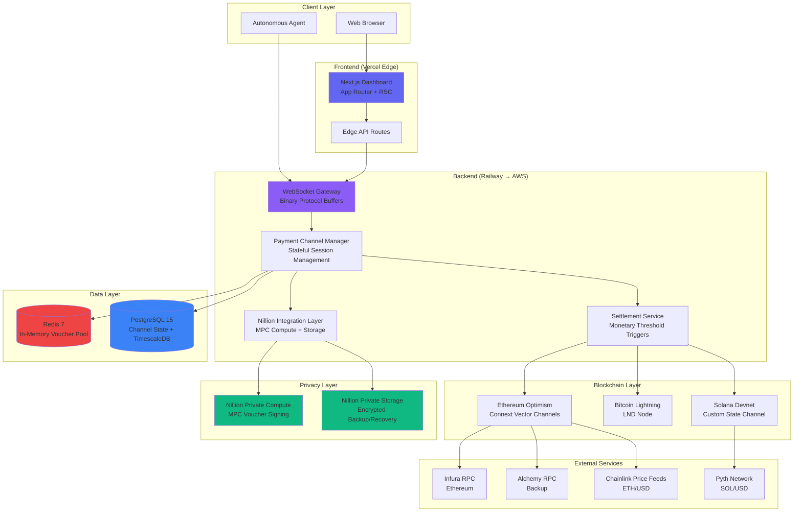

# Nillion-Powered Web-Native Micropayment Protocol - Fullstack Architecture Document

**Version:** 1.0
**Last Updated:** November 16, 2025
**Status:** Final - Ready for Development

---

## Introduction

This document outlines the complete fullstack architecture for **Nillion-Powered Web-Native Micropayment Protocol**, including backend systems, frontend implementation, and their integration. It serves as the single source of truth for AI-driven development, ensuring consistency across the entire technology stack.

This unified approach combines what would traditionally be separate backend and frontend architecture documents, streamlining the development process for this modern fullstack application where these concerns are tightly integrated through shared TypeScript types, Protocol Buffer schemas, and unified Nillion MPC signatures.

### Starter Template or Existing Project

**Template:** Turborepo Official Starter (`npx create-turbo@latest`)

**Rationale:**

This project is based on the **Turborepo official starter** with Next.js and TypeScript. This choice was made because:

1. **Monorepo Requirement**: The PRD specifies tight coordination between 6+ packages (client-sdk, server-sdk, protocol, nillion-adapter, demo app, dashboard app, docs site). Turborepo provides optimal build caching and task orchestration.

2. **TypeScript Ecosystem**: Full TypeScript support with strict mode aligns with the PRD's requirement for TypeScript-first development with Node.js 18+ WebCrypto API support.

3. **Build Performance**: With Epic 1-5 requiring parallel testing across 3 blockchain integrations (Ethereum, Bitcoin, Solana), Turborepo's intelligent caching reduces CI/CD times by 6-10×.

4. **Package Manager Alignment**: Native pnpm workspace support matches the technical assumptions specifying pnpm as the package manager.

5. **Next.js 14 Integration**: Official Turborepo starter includes Next.js configuration pre-optimized for monorepo builds, supporting the dashboard's App Router and React Server Components requirements.

**Architectural Decisions Already Made by Template:**

- **Workspace structure**: `apps/*` for deployable applications, `packages/*` for shared libraries
- **Build tool**: Turborepo for orchestration, tsup/tsc for package compilation, Next.js for app building
- **TypeScript configuration**: Shared tsconfig.json with project-specific extensions
- **Shared tooling**: ESLint, TypeScript configs centralized in `packages/config-*`

**What Can Be Modified:**

- Package contents and internal architecture (fully customizable)
- Database schema and deployment targets (template includes no backend services)
- Testing framework (starter is framework-agnostic)
- Additional packages (Nillion adapter, Protocol Buffer definitions, blockchain integrations)

**What Must Be Retained:**

- Turborepo configuration structure (required for build orchestration)
- pnpm workspace definition (enables shared dependencies)
- Package naming conventions (workspace dependencies use `workspace:*` protocol)

**Template Documentation:** https://turbo.build/repo/docs/getting-started/create-new

---

### Change Log

| Date | Version | Description | Author |
|------|---------|-------------|---------|
| 2025-11-16 | 1.0 | Initial architecture document created | Winston (Architect Agent) |

---

## High Level Architecture

### Technical Summary

This is a **hybrid serverless-monolithic architecture** deployed across cloud infrastructure with multi-chain blockchain integration. The system combines:

**Frontend**: Next.js 14 dashboard (App Router, RSC) deployed to Vercel edge network, serving real-time WebSocket connections to monitoring UI with <50ms client-side latency. TypeScript React components use shadcn/ui with Tailwind CSS for developer-focused data visualization.

**Backend**: Node.js monolithic server (MVP) handling WebSocket gateway, payment channel management, Nillion MPC integration, and settlement orchestration. Stateful in-memory voucher pools backed by Redis provide <1ms lookup for 1000+ pkt/sec throughput. PostgreSQL with TimescaleDB extension persists payment channel state and metrics time-series.

**Blockchain Layer**: Three parallel integrations—Ethereum Optimism (Connext Vector state channels), Bitcoin Lightning Network (LND), Solana (custom state channel program)—unified through shared Nillion MPC voucher signing. Cross-chain atomic swaps enable payment routing across all three networks.

**Privacy Layer**: Nillion Private Compute pre-signs 100 vouchers during handshake (10s one-time cost), served from memory during streaming (0.001ms). Nillion Private Storage provides crash recovery for autonomous agents, storing encrypted voucher backups in distributed MPC shares.

**Deployment**: MVP runs on Railway (cost-optimized single-region), production migrates to microservices with edge-deployed WebSocket gateway (Cloudflare Workers or AWS Lambda@Edge) and centralized payment channel manager. Monetary threshold settlements ($100/$1000) keep on-chain costs economical while maintaining privacy.

This architecture achieves the PRD's <100ms p95 latency and 1000+ pkt/sec targets while proving Nillion MPC viability at $12k/month operational cost (200× cheaper than naive per-packet MPC).

---

### Platform and Infrastructure Choice

Based on PRD requirements (rapid MVP iteration, cost constraints, future microservices migration), I evaluated three platform options:

**Option 1: Vercel + Railway + Managed Blockchain RPC**
- **Frontend**: Vercel (Next.js optimized, edge network, automatic previews)
- **Backend**: Railway (developer experience, PostgreSQL included, cost-effective $20-50/month MVP)
- **Database**: Railway PostgreSQL with TimescaleDB
- **Cache**: Railway Redis
- **Blockchain RPC**: Infura (Ethereum), Alchemy (backup), public testnet nodes (Bitcoin/Solana)
- **Pros**: Fastest time-to-deployment, lowest MVP cost (~$100/month total), excellent DX, Railway handles DB backups
- **Cons**: Vendor lock-in, harder microservices migration, single-region backend (higher latency)

**Option 2: AWS Full Stack**
- **Frontend**: AWS Amplify (Next.js hosting)
- **Backend**: ECS Fargate (containerized Node.js)
- **Database**: RDS PostgreSQL + ElastiCache Redis
- **Blockchain RPC**: Same (Infura/Alchemy)
- **Pros**: Enterprise-ready, clear microservices path (ECS → Lambda@Edge), multi-region capable
- **Cons**: Complex setup, higher cost ($300-500/month MVP), slower iteration, steeper learning curve

**Option 3: Google Cloud (Cloud Run + Firebase)**
- **Frontend**: Firebase Hosting
- **Backend**: Cloud Run (containerized)
- **Database**: Cloud SQL PostgreSQL + Memorystore Redis
- **Pros**: Good middle ground (DX + scale), Cloud Run autoscaling
- **Cons**: Less Next.js optimization than Vercel, moderate cost ($150-250/month)

---

**RECOMMENDATION: Option 1 (Vercel + Railway) for MVP, migrate to AWS/GCP for production**

**Rationale:**

1. **PRD alignment**: Technical assumptions specify Railway as preferred for "cost + DX" with "AWS/GCP acceptable"
2. **Speed to value**: Vercel + Railway deployment in <1 hour vs AWS 1-2 days setup
3. **Cost constraints**: $100/month fits within PoC budget; AWS $500/month doesn't
4. **Migration path**: Railway Docker containers transfer directly to AWS ECS/GCP Cloud Run in Week 19+
5. **Blockchain RPC agnostic**: All options use same Infura/Alchemy providers

**Platform Decision:**

| Component | Technology | Deployment Region |
|-----------|-----------|-------------------|
| **Frontend** | Vercel Edge Network | Global (CDN, edge-rendered RSC) |
| **Backend (MVP)** | Railway (us-west-1) | US West (single region) |
| **Backend (Prod)** | AWS Lambda@Edge + ECS | Multi-region (edge gateway + central manager) |
| **Database** | Railway PostgreSQL 15 + TimescaleDB | US West (MVP), RDS Multi-AZ (Prod) |
| **Cache** | Railway Redis 7 | US West (MVP), ElastiCache (Prod) |
| **Blockchain RPC** | Infura (primary), Alchemy (failover) | Provider-managed |
| **Monitoring** | Vercel Analytics + Railway metrics (MVP), Datadog (Prod) | N/A |

**Key Services:**
- **Vercel**: Next.js dashboard, edge functions for API routes
- **Railway**: Node.js WebSocket server, PostgreSQL, Redis
- **Infura**: Ethereum Optimism RPC
- **Alchemy**: Ethereum backup RPC
- **Public nodes**: Bitcoin testnet, Solana devnet (MVP only)

---

### Repository Structure

**Structure:** Turborepo monorepo with pnpm workspaces

**Rationale:**

The PRD requires six tightly coupled packages with shared TypeScript types (Nillion voucher interfaces, payment channel state) and Protocol Buffer definitions. Monorepo enables atomic commits across SDK breaking changes and unified versioning for coherent releases. A single CI/CD pipeline can test all 3 chain integrations in parallel.

**Package Organization:**

```
nillion-micropayment-protocol/          # Root
├── .github/
│   └── workflows/
│       ├── ci.yaml                     # Test all packages + apps
│       ├── deploy-dashboard.yaml       # Vercel deployment
│       └── deploy-server.yaml          # Railway deployment
├── apps/
│   ├── dashboard/                      # Next.js 14 monitoring UI
│   │   ├── src/
│   │   │   ├── app/                    # App Router pages
│   │   │   ├── components/             # Dashboard-specific components
│   │   │   └── lib/                    # Dashboard utilities
│   │   ├── public/
│   │   ├── package.json
│   │   └── next.config.js
│   ├── server/                         # Node.js backend monolith
│   │   ├── src/
│   │   │   ├── websocket/              # WebSocket gateway
│   │   │   ├── channels/               # Payment channel manager
│   │   │   ├── nillion/                # Nillion integration
│   │   │   ├── settlement/             # Settlement service
│   │   │   ├── monitoring/             # Metrics collection
│   │   │   └── index.ts                # Server entry point
│   │   ├── tests/
│   │   ├── Dockerfile
│   │   └── package.json
│   └── demo/                           # Developer integration example
│       ├── src/
│       ├── package.json
│       └── README.md
├── packages/
│   ├── client-sdk/                     # Browser/Node.js client SDK
│   │   ├── src/
│   │   │   ├── voucher/                # Voucher management
│   │   │   ├── channel/                # Channel lifecycle
│   │   │   └── index.ts
│   │   ├── tests/
│   │   └── package.json
│   ├── server-sdk/                     # Node.js server SDK
│   │   ├── src/
│   │   │   ├── verification/           # Payment verification
│   │   │   ├── settlement/             # Settlement logic
│   │   │   └── index.ts
│   │   └── package.json
│   ├── protocol/                       # Protocol Buffer schemas
│   │   ├── proto/
│   │   │   ├── voucher.proto
│   │   │   ├── payment.proto
│   │   │   └── channel.proto
│   │   ├── generated/                  # TypeScript types from protoc
│   │   └── package.json
│   ├── nillion-adapter/                # Nillion Private Compute/Storage wrapper
│   │   ├── src/
│   │   │   ├── compute/                # MPC signing
│   │   │   ├── storage/                # Backup/recovery
│   │   │   └── mock/                   # Local dev mock
│   │   └── package.json
│   ├── shared/                         # Shared utilities and types
│   │   ├── src/
│   │   │   ├── types/                  # Shared TypeScript interfaces
│   │   │   ├── constants/              # Chain IDs, contract addresses
│   │   │   └── utils/                  # Common helpers
│   │   └── package.json
│   └── config/                         # Shared configs
│       ├── eslint/
│       ├── typescript/
│       └── jest/
├── docs/                               # Documentation site (VitePress)
│   ├── prd.md
│   ├── architecture.md                 # This document
│   └── api/
├── scripts/                            # Build/deploy scripts
│   ├── setup-testnets.sh
│   └── benchmark.ts
├── turbo.json                          # Turborepo pipeline config
├── pnpm-workspace.yaml
├── package.json
└── README.md
```

**Monorepo Tool:** Turborepo 1.x

**Package Strategy:**
- **Packages are independently versioned** (semantic versioning)
- **Apps always use latest package versions** (workspace:*)
- **Shared types in `packages/shared`** prevent circular dependencies
- **Protocol package generates TypeScript** from .proto files at build time

---

### High Level Architecture Diagram



---

### Architectural Patterns

- **Jamstack Architecture (Frontend):** Static site generation with serverless API routes - _Rationale:_ Optimal performance for dashboard (CDN-cached components) with dynamic data via client-side fetch and WebSocket

- **Monolithic Modular Backend (MVP):** Single Node.js service with clear module boundaries (WebSocket/Channels/Nillion/Settlement as separate folders) - _Rationale:_ Rapid iteration during PoC development while maintaining clean separation for microservices extraction post-MVP

- **Repository Pattern (Data Access):** Abstract database operations behind interfaces in server-sdk - _Rationale:_ Enables testing with in-memory stores and future migration from PostgreSQL to distributed database if needed

- **Adapter Pattern (Nillion Integration):** `nillion-adapter` package wraps Nillion SDK with mock implementation for local development - _Rationale:_ Developers can work without Nillion API access; CI/CD tests run against mocks; production swaps in real Nillion client

- **Protocol Buffers (Wire Format):** All WebSocket messages use binary protobuf encoding - _Rationale:_ 1.3% overhead vs JSON's 30-40%, critical for 1000 pkt/sec target; schema evolution support for versioning

- **In-Memory Cache-Aside (Vouchers):** Redis caches hot vouchers with PostgreSQL as source of truth - _Rationale:_ <1ms lookup required for latency target; Redis cleared on crash, PostgreSQL enables recovery

- **Event-Driven Settlement (Backend):** Settlement service subscribes to monetary threshold events from Channel Manager - _Rationale:_ Decouples settlement logic from payment processing; enables async batch settlements

- **Backend-for-Frontend (BFF) Pattern:** Next.js Edge API routes aggregate multiple backend WebSocket streams for dashboard - _Rationale:_ Reduces client-side complexity; edge routes provide <50ms latency from dashboard to data

- **Command Query Responsibility Segregation (CQRS):** Write operations (create channel, send payment) go through WebSocket; read operations (query history, metrics) use REST API - _Rationale:_ Optimizes WebSocket for real-time writes; REST GET requests cacheable by Vercel edge

- **Circuit Breaker (External APIs):** Nillion/Infura/Alchemy calls wrapped in circuit breaker with exponential backoff - _Rationale:_ Prevents cascade failures when external services degrade; dashboard shows degraded state without crashing

---

## Tech Stack

This table is the **single source of truth** for all technology decisions. All development must use these exact versions. Any deviation requires architecture review and update to this document.

### Technology Stack Table

| Category | Technology | Version | Purpose | Rationale |
|----------|-----------|---------|---------|-----------|
| **Frontend Language** | TypeScript | 5.3+ | Type-safe frontend development | Strict mode enforced; catches 80% of runtime errors at compile time; shared types with backend via `packages/shared` |
| **Frontend Framework** | Next.js | 14.2+ | React-based dashboard application | App Router for RSC (reduced client bundle), edge runtime support, Vercel optimization, built-in API routes for BFF pattern |
| **UI Component Library** | shadcn/ui | 0.8+ | Accessible UI primitives | Radix UI underneath (WAI-ARIA compliant), copy-paste customization (no node_modules lock-in), TypeScript-first, minimal bundle impact |
| **State Management** | Zustand | 4.5+ | Lightweight global state | 1KB vs Redux 20KB, perfect for dashboard real-time metrics, built-in DevTools, TypeScript inference, no boilerplate |
| **Backend Language** | TypeScript | 5.3+ | Type-safe backend development | Same language as frontend (shared types), Node.js 18+ WebCrypto API support required for Nillion integration |
| **Backend Framework** | Fastify | 4.26+ | High-performance HTTP + WebSocket server | 2× faster than Express, native TypeScript support, schema-based validation (for protobuf), WebSocket plugin for binary framing |
| **API Style** | WebSocket (Binary Protocol Buffers) + REST | Custom + OpenAPI 3.0 | Real-time payments + query API | WebSocket for <100ms bidirectional streaming, REST for dashboard queries/analytics (cacheable at edge) |
| **Database** | PostgreSQL | 15.6+ | Relational data persistence | ACID guarantees for payment channel state, JSON columns for flexible voucher metadata, battle-tested for financial systems |
| **Time-Series Extension** | TimescaleDB | 2.14+ | Metrics and performance data | Hypertables for latency/throughput time-series, automatic partitioning, 10-100× compression vs raw PostgreSQL |
| **Cache** | Redis | 7.2+ | In-memory voucher pool | <1ms lookup required for 1000 pkt/sec target, Pub/Sub for multi-instance coordination (production), persistence for crash recovery |
| **File Storage** | N/A (Nillion Private Storage) | - | Encrypted voucher backup | Nillion Private Storage replaces traditional S3/blob storage; distributed MPC shares prevent single-point compromise |
| **Authentication** | Wallet Connection (wagmi + RainbowKit) | wagmi 2.5+, RainbowKit 2.0+ | Ethereum wallet authentication | Web3 native auth (no passwords), supports MetaMask/WalletConnect/Coinbase, auto-detects networks, TypeScript SDK |
| **Frontend Testing** | Vitest + React Testing Library | Vitest 1.3+, RTL 14.2+ | Component and integration testing | 10× faster than Jest (ESM native), compatible with Jest API, React Testing Library for accessible testing patterns |
| **Backend Testing** | Vitest + Testcontainers | Vitest 1.3+, Testcontainers 10.6+ | Unit and integration testing | Same test runner as frontend (shared config), Testcontainers for PostgreSQL/Redis in CI, no mocking databases |
| **E2E Testing** | Manual (MVP), Playwright (Production) | Playwright 1.42+ (future) | End-to-end user flows | Manual testing sufficient for PoC (<4 hour integration target), Playwright deferred to Week 19-22 production hardening |
| **Build Tool** | Turborepo | 1.12+ | Monorepo task orchestration | Intelligent caching (6-10× faster CI), parallel builds across packages, remote cache support for team collaboration |
| **Bundler** | Next.js (Turbopack) + tsup | Turbopack (built-in), tsup 8.0+ | Application and package bundling | Next.js uses Turbopack (Rust-based, 700× faster than Webpack), tsup for library packages (esbuild-based, outputs ESM+CJS) |
| **Package Manager** | pnpm | 8.15+ | Dependency management | 3× faster than npm, disk space efficient (content-addressed store), strict workspace protocol, lockfile prevents phantom deps |
| **IaC Tool** | Railway CLI + Docker Compose | Railway CLI 3.x, Docker Compose 2.24+ | Infrastructure provisioning | Railway CLI for MVP deployment, Docker Compose for local multi-service dev environment, migrate to Terraform (Prod) |
| **CI/CD** | GitHub Actions | N/A | Automated testing and deployment | Free for public repos, Turborepo remote cache integration, parallel matrix builds for 3 chains, Vercel/Railway deploy actions |
| **Monitoring** | Vercel Analytics + Railway Metrics (MVP), Datadog (Prod) | Datadog 7.x (future) | Performance and error tracking | Vercel built-in for frontend vitals, Railway metrics for backend, Datadog for production APM + distributed tracing |
| **Logging** | Pino | 8.19+ | Structured JSON logging | 5× faster than Winston, JSON output for log aggregation, built-in log levels, redaction for sensitive data (private keys) |
| **CSS Framework** | Tailwind CSS | 3.4+ | Utility-first styling | Purges unused CSS (10KB final bundle), JIT compiler, consistent with shadcn/ui, responsive prefixes, dark mode built-in |
| **CSS-in-JS** | N/A (Tailwind only) | - | Avoid runtime CSS cost | Tailwind handles 95% of needs; no Emotion/Styled Components (add 10-20KB + runtime cost) |
| **Linting** | ESLint + TypeScript ESLint | ESLint 8.57+, TS-ESLint 7.0+ | Code quality enforcement | Catch bugs before runtime, enforce coding standards, accessibility linting (jsx-a11y), shared config in packages/config |
| **Formatting** | Prettier | 3.2+ | Consistent code formatting | Auto-format on save, shared config, integrates with ESLint, prevents style debates |
| **Protobuf Compiler** | protobuf-ts | 2.9+ | Protocol Buffer TypeScript generation | Generates type-safe TypeScript from .proto files, runtime encoding/decoding, supports proto3 features, integrates with tsup |
| **Blockchain - Ethereum** | ethers.js | 6.11+ | Ethereum contract interaction | Industry standard, v6 adds native TypeScript, Connext Vector SDK dependency, supports Optimism L2 |
| **Blockchain - Bitcoin** | LND (via @radar/lnrpc) | LND 0.17+, lnrpc 0.3+ | Lightning Network integration | Official LND gRPC client, TypeScript bindings, supports channel management + payment routing, testnet compatible |
| **Blockchain - Solana** | @solana/web3.js | 1.91+ | Solana RPC and transactions | Official Solana SDK, supports state channels (experimental), anchor program integration, devnet compatible |
| **Nillion SDK** | @nillion/client-js (assumed) | TBD | Nillion Private Compute/Storage | **CRITICAL BLOCKER**: Requires partnership and SDK access; fallback to mock adapter for local dev if unavailable |
| **WebSocket Library** | ws (via Fastify plugin) | 8.16+ | Binary WebSocket server | Native Node.js implementation, integrates with Fastify, supports binary frames (protobuf), backpressure handling |
| **Validation** | Zod | 3.22+ | Runtime type validation | TypeScript-first schema validation, integrates with tRPC/Fastify, validates protobuf decoded objects, error messages |
| **Date/Time** | date-fns | 3.3+ | Date manipulation | Tree-shakeable (vs moment.js 200KB), TypeScript support, no global locale pollution, FP style |
| **Charting** | Recharts | 2.12+ | Dashboard data visualization | React-first, composable charts (line/area/bar), responsive, accessible (ARIA labels), smaller than Chart.js |
| **ORM/Query Builder** | Kysely | 0.27+ | Type-safe SQL query builder | End-to-end type safety (schema → queries → results), no magic (raw SQL visible), PostgreSQL dialect, TimescaleDB compatible |
| **Migration Tool** | node-pg-migrate | 6.2+ | Database schema versioning | JavaScript-based migrations, rollback support, works with Kysely, Railway CLI integration |
| **HTTP Client** | native fetch (Node 18+) | Built-in | HTTP requests to Infura/Alchemy | Node 18+ includes fetch; no axios needed (saves 30KB), matches browser API, supports AbortController |

---

## Data Models

These models represent the core business entities of the Nillion micropayment protocol. All models are defined as TypeScript interfaces in `packages/shared/src/types` and used across frontend, backend, and SDKs.

### Model: User

**Purpose:** Represents a participant in the payment system (payer or payee). Users are identified by their blockchain wallet addresses across all three chains.

**Key Attributes:**
- `id`: string (UUID) - Internal unique identifier for database relations
- `ethereumAddress`: string (0x-prefixed hex) - Ethereum Optimism wallet address (primary identity)
- `bitcoinAddress`: string (optional) - Bitcoin Lightning node public key or on-chain address
- `solanaAddress`: string (optional) - Solana wallet public key (base58 encoded)
- `nillionUserId`: string (optional) - Nillion network user ID for MPC operations
- `createdAt`: Date - Account creation timestamp
- `lastSeenAt`: Date - Last activity timestamp

#### TypeScript Interface

```typescript
export interface User {
  id: string; // UUID v4
  ethereumAddress: string; // Required: primary identity
  bitcoinAddress?: string; // Optional: Bitcoin Lightning pubkey
  solanaAddress?: string; // Optional: Solana pubkey
  nillionUserId?: string; // Optional: assigned after first Nillion operation
  createdAt: Date;
  lastSeenAt: Date;
}
```

#### Relationships
- One User has many PaymentChannels (as opener or counterparty)
- One User has many VoucherPools
- One User has many Transactions (as sender or receiver)

---

### Model: PaymentChannel

**Purpose:** Represents an off-chain payment channel on one of the three blockchains. Channels enable high-frequency micropayments without on-chain settlement for every transaction.

**Key Attributes:**
- `id`: string (UUID) - Internal unique identifier
- `chainId`: ChainType - Which blockchain (ETHEREUM_OPTIMISM | BITCOIN_LIGHTNING | SOLANA)
- `channelId`: string - On-chain channel identifier (chain-specific format)
- `openerUserId`: string - User who created/funded the channel
- `counterpartyUserId`: string - Other participant
- `status`: ChannelStatus - OPENING | OPEN | CLOSING | CLOSED | DISPUTED
- `capacity`: bigint - Maximum channel capacity in smallest unit (wei/satoshi/lamport)
- `localBalance`: bigint - Opener's current balance
- `remoteBalance`: bigint - Counterparty's current balance
- `nonce`: number - State update counter (prevents replay attacks)
- `settlementThreshold`: bigint - Monetary threshold for automatic settlement
- `onChainTxHash`: string - Opening transaction hash
- `createdAt`: Date
- `lastActivityAt`: Date
- `closedAt`: Date (optional)

#### TypeScript Interface

```typescript
export enum ChainType {
  ETHEREUM_OPTIMISM = 'ETHEREUM_OPTIMISM',
  BITCOIN_LIGHTNING = 'BITCOIN_LIGHTNING',
  SOLANA = 'SOLANA',
}

export enum ChannelStatus {
  OPENING = 'OPENING',     // Transaction submitted, awaiting confirmation
  OPEN = 'OPEN',           // Active, can process payments
  CLOSING = 'CLOSING',     // Closure initiated, awaiting finalization
  CLOSED = 'CLOSED',       // Finalized on-chain
  DISPUTED = 'DISPUTED',   // Fraud proof challenge period
}

export interface PaymentChannel {
  id: string;
  chainId: ChainType;
  channelId: string; // Format depends on chain (e.g., Vector channelAddress, LN channel point)
  openerUserId: string;
  counterpartyUserId: string;
  status: ChannelStatus;
  capacity: bigint; // Total locked funds
  localBalance: bigint; // Opener's balance
  remoteBalance: bigint; // Counterparty's balance
  nonce: number; // Increments with each state update
  settlementThreshold: bigint; // e.g., $100 in wei/sat/lamport
  onChainTxHash: string;
  createdAt: Date;
  lastActivityAt: Date;
  closedAt?: Date;
}
```

#### Relationships
- One PaymentChannel belongs to one User (opener)
- One PaymentChannel belongs to one User (counterparty)
- One PaymentChannel has many Payments
- One PaymentChannel has one active VoucherPool

---

### Model: Voucher

**Purpose:** Represents a pre-signed Nillion MPC voucher that authorizes a payment up to a specific amount without requiring real-time MPC signing. This is the core innovation enabling <100ms latency.

**Key Attributes:**
- `id`: string (UUID) - Internal identifier
- `voucherId`: string - Unique voucher identifier (embedded in MPC signature)
- `channelId`: string - Associated payment channel
- `nonce`: number - Voucher sequence number within pool
- `amountLimit`: bigint - Maximum payment this voucher can authorize
- `expiresAt`: Date - Expiration timestamp (1-hour TTL)
- `mpcSignature`: Buffer - Nillion MPC signature (binary)
- `status`: VoucherStatus - UNUSED | CONSUMED | EXPIRED
- `consumedByPaymentId`: string (optional) - Payment that used this voucher
- `createdAt`: Date

#### TypeScript Interface

```typescript
export enum VoucherStatus {
  UNUSED = 'UNUSED',       // Available in pool
  CONSUMED = 'CONSUMED',   // Used for a payment
  EXPIRED = 'EXPIRED',     // TTL exceeded
}

export interface Voucher {
  id: string;
  voucherId: string; // Format: nillion_<uuid>
  channelId: string; // FK to PaymentChannel
  nonce: number; // 0-99 for 100-voucher pool
  amountLimit: bigint;
  expiresAt: Date; // createdAt + 1 hour
  mpcSignature: Buffer; // Binary Nillion signature
  status: VoucherStatus;
  consumedByPaymentId?: string;
  createdAt: Date;
}
```

#### Relationships
- One Voucher belongs to one PaymentChannel
- One Voucher consumed by zero or one Payment

---

### Model: VoucherPool

**Purpose:** Represents a collection of 100 pre-signed vouchers created during the handshake phase. Pools are backed up to Nillion Private Storage for crash recovery.

**Key Attributes:**
- `id`: string (UUID)
- `channelId`: string - Associated payment channel
- `poolNonce`: number - Pool sequence number (increments when regenerated)
- `voucherCount`: number - Total vouchers (always 100)
- `unusedCount`: number - Available vouchers (decrements as consumed)
- `nillionStorageId`: string - Nillion Private Storage backup reference
- `lastBackupAt`: Date - Last backup to Nillion Storage
- `createdAt`: Date

#### TypeScript Interface

```typescript
export interface VoucherPool {
  id: string;
  channelId: string; // FK to PaymentChannel
  poolNonce: number; // Increments each time pool is regenerated
  voucherCount: number; // Always 100
  unusedCount: number; // Decrements as vouchers consumed
  nillionStorageId: string; // Reference to Nillion Private Storage backup
  lastBackupAt: Date;
  createdAt: Date;
}
```

#### Relationships
- One VoucherPool belongs to one PaymentChannel
- One VoucherPool has many Vouchers (100)

---

### Model: Payment

**Purpose:** Represents a single micropayment within a payment channel. Payments are authorized by consuming a voucher and update the channel's local/remote balance.

**Key Attributes:**
- `id`: string (UUID)
- `channelId`: string - Payment channel
- `voucherId`: string - Authorizing voucher
- `senderUserId`: string
- `receiverUserId`: string
- `amount`: bigint - Payment amount in smallest unit
- `nonce`: number - Channel state nonce after this payment
- `status`: PaymentStatus - PENDING | COMPLETED | FAILED
- `latencyMs`: number - End-to-end processing time (target <100ms)
- `createdAt`: Date
- `completedAt`: Date (optional)

#### TypeScript Interface

```typescript
export enum PaymentStatus {
  PENDING = 'PENDING',
  COMPLETED = 'COMPLETED',
  FAILED = 'FAILED',
}

export interface Payment {
  id: string;
  channelId: string; // FK to PaymentChannel
  voucherId: string; // FK to Voucher
  senderUserId: string; // FK to User
  receiverUserId: string; // FK to User
  amount: bigint;
  nonce: number; // Channel state nonce after payment
  status: PaymentStatus;
  latencyMs: number; // Measured end-to-end
  createdAt: Date;
  completedAt?: Date;
}
```

#### Relationships
- One Payment belongs to one PaymentChannel
- One Payment consumes one Voucher
- One Payment has one sender (User)
- One Payment has one receiver (User)

---

### Model: Settlement

**Purpose:** Represents an on-chain settlement triggered by monetary threshold. Settlements batch multiple payments and finalize them on the blockchain.

**Key Attributes:**
- `id`: string (UUID)
- `channelId`: string
- `chainId`: ChainType
- `settlementType`: SettlementType - MONETARY_THRESHOLD | MANUAL | CHANNEL_CLOSURE
- `paymentCount`: number - Number of payments included
- `totalAmount`: bigint - Sum of all payments
- `onChainTxHash`: string
- `status`: SettlementStatus - PENDING | CONFIRMED | FAILED
- `gasUsed`: bigint (optional)
- `gasCost`: bigint (optional)
- `createdAt`: Date
- `confirmedAt`: Date (optional)

#### TypeScript Interface

```typescript
export enum SettlementType {
  MONETARY_THRESHOLD = 'MONETARY_THRESHOLD', // $100/$1000 threshold hit
  MANUAL = 'MANUAL', // User-initiated
  CHANNEL_CLOSURE = 'CHANNEL_CLOSURE', // Channel closing
}

export enum SettlementStatus {
  PENDING = 'PENDING',
  CONFIRMED = 'CONFIRMED',
  FAILED = 'FAILED',
}

export interface Settlement {
  id: string;
  channelId: string; // FK to PaymentChannel
  chainId: ChainType;
  settlementType: SettlementType;
  paymentCount: number;
  totalAmount: bigint;
  onChainTxHash: string;
  status: SettlementStatus;
  gasUsed?: bigint;
  gasCost?: bigint;
  createdAt: Date;
  confirmedAt?: Date;
}
```

#### Relationships
- One Settlement belongs to one PaymentChannel
- One Settlement finalizes many Payments (implicit, tracked via channel nonce)

---

### Model: CrossChainSwap

**Purpose:** Represents an atomic swap between two blockchains (e.g., BTC → ETH). Swaps use HTLCs (Hash Time-Locked Contracts) to ensure atomicity.

**Key Attributes:**
- `id`: string (UUID)
- `sourceChainId`: ChainType
- `destinationChainId`: ChainType
- `sourceChannelId`: string
- `destinationChannelId`: string
- `userId`: string - User initiating swap
- `sourceAmount`: bigint
- `destinationAmount`: bigint
- `exchangeRate`: number - Locked-in rate at swap initiation
- `htlcSecret`: Buffer - Preimage for HTLC unlock
- `htlcHash`: string - Hash of secret (public)
- `status`: SwapStatus
- `sourceTxHash`: string (optional)
- `destinationTxHash`: string (optional)
- `expiresAt`: Date - HTLC timeout (30 minutes)
- `createdAt`: Date
- `completedAt`: Date (optional)

#### TypeScript Interface

```typescript
export enum SwapStatus {
  INITIATED = 'INITIATED',         // Swap created
  SOURCE_LOCKED = 'SOURCE_LOCKED', // Source chain funds locked
  DEST_LOCKED = 'DEST_LOCKED',     // Destination chain funds locked
  COMPLETED = 'COMPLETED',         // Secret revealed, both chains settled
  REFUNDED = 'REFUNDED',           // Timeout, funds returned
  FAILED = 'FAILED',               // Error during process
}

export interface CrossChainSwap {
  id: string;
  sourceChainId: ChainType;
  destinationChainId: ChainType;
  sourceChannelId: string; // FK to PaymentChannel
  destinationChannelId: string; // FK to PaymentChannel
  userId: string; // FK to User (initiator)
  sourceAmount: bigint;
  destinationAmount: bigint;
  exchangeRate: number; // e.g., 0.000033 BTC/ETH
  htlcSecret: Buffer; // Kept secret until reveal phase
  htlcHash: string; // SHA256(htlcSecret), public
  status: SwapStatus;
  sourceTxHash?: string;
  destinationTxHash?: string;
  expiresAt: Date; // HTLC timeout (30 min)
  createdAt: Date;
  completedAt?: Date;
}
```

#### Relationships
- One CrossChainSwap has one source PaymentChannel
- One CrossChainSwap has one destination PaymentChannel
- One CrossChainSwap belongs to one User (initiator)

---

### Model: PerformanceMetric

**Purpose:** Time-series data for monitoring system performance. Stored in TimescaleDB hypertables for efficient aggregation and querying.

**Key Attributes:**
- `timestamp`: Date - Measurement time (hypertable partition key)
- `metricType`: MetricType - LATENCY | THROUGHPUT | SUCCESS_RATE
- `chainId`: ChainType (optional) - Null for cross-chain metrics
- `value`: number - Metric value (ms for latency, pkt/sec for throughput, % for success rate)
- `p50`: number (optional) - 50th percentile (for latency)
- `p95`: number (optional) - 95th percentile (for latency)
- `p99`: number (optional) - 99th percentile (for latency)

#### TypeScript Interface

```typescript
export enum MetricType {
  LATENCY = 'LATENCY',
  THROUGHPUT = 'THROUGHPUT',
  SUCCESS_RATE = 'SUCCESS_RATE',
}

export interface PerformanceMetric {
  timestamp: Date; // TimescaleDB partition key
  metricType: MetricType;
  chainId?: ChainType; // Null for aggregate metrics
  value: number; // Actual measured value
  p50?: number; // Median latency
  p95?: number; // 95th percentile latency (target: <100ms)
  p99?: number; // 99th percentile latency
}
```

#### Relationships
- No foreign keys (time-series data, optimized for append-only writes)

---

## API Specification

This system uses a **hybrid API architecture**:

- **WebSocket (Binary Protocol Buffers)**: Real-time bidirectional payment streaming
- **REST (OpenAPI 3.0)**: Dashboard queries, analytics, and admin operations

### WebSocket Binary Protocol API

**Connection URL:** `wss://api.nillion-pay.example.com/v1/stream`

**Authentication:** Wallet signature challenge (SIWE - Sign-In with Ethereum)

**Binary Framing:** All messages encoded as Protocol Buffer v3, wrapped in length-prefixed frames

**Message Flow:**
1. Client connects to WebSocket
2. Server sends `AuthChallenge` message
3. Client responds with `AuthResponse` (signed message)
4. Server verifies signature and sends `AuthSuccess` or `AuthFailure`
5. Authenticated clients can send/receive payment messages

**Protocol Buffer Schema (simplified - full schema in packages/protocol/proto/):**

```protobuf
syntax = "proto3";

package nillion.payment.v1;

// Wrapper for all messages
message StreamMessage {
  oneof payload {
    AuthChallenge auth_challenge = 1;
    AuthResponse auth_response = 2;
    AuthSuccess auth_success = 3;
    CreateChannelRequest create_channel_request = 10;
    CreateChannelResponse create_channel_response = 11;
    SendPaymentRequest send_payment_request = 20;
    SendPaymentResponse send_payment_response = 21;
    VoucherPoolStatus voucher_pool_status = 30;
    ChannelUpdate channel_update = 40;
    ErrorMessage error = 99;
  }
}

message AuthChallenge {
  string challenge = 1; // Random nonce
  int64 timestamp = 2;
}

message AuthResponse {
  string ethereum_address = 1;
  string signature = 2; // ECDSA signature of challenge
  optional string bitcoin_address = 3;
  optional string solana_address = 4;
}

message AuthSuccess {
  string user_id = 1;
  string session_id = 2;
}

message CreateChannelRequest {
  string chain_id = 1; // "ETHEREUM_OPTIMISM" | "BITCOIN_LIGHTNING" | "SOLANA"
  string counterparty_address = 2;
  string capacity = 3; // bigint as string (e.g., "1000000000000000000" for 1 ETH)
  string settlement_threshold = 4; // bigint as string
}

message CreateChannelResponse {
  string channel_id = 1;
  string status = 2; // "OPENING" | "OPEN"
  string on_chain_tx_hash = 3;
  VoucherPool voucher_pool = 4;
}

message VoucherPool {
  string pool_id = 1;
  int32 total_vouchers = 2; // Always 100
  int32 unused_vouchers = 3;
  string nillion_storage_id = 4;
  int64 last_backup_at = 5; // Unix timestamp
}

message SendPaymentRequest {
  string channel_id = 1;
  string amount = 2; // bigint as string
  string voucher_id = 3; // Pre-selected voucher from pool
}

message SendPaymentResponse {
  string payment_id = 1;
  string status = 2; // "COMPLETED" | "FAILED"
  int32 latency_ms = 3;
  int32 new_nonce = 4;
  string local_balance = 5; // bigint as string
  string remote_balance = 6; // bigint as string
}

message VoucherPoolStatus {
  string channel_id = 1;
  int32 unused_vouchers = 2;
  bool regeneration_needed = 3; // True if < 10 vouchers remain
}

message ChannelUpdate {
  string channel_id = 1;
  string status = 2; // "OPENING" | "OPEN" | "CLOSING" | "CLOSED"
  string local_balance = 3;
  string remote_balance = 4;
  int32 nonce = 5;
}

message ErrorMessage {
  string code = 1; // "VOUCHER_EXPIRED" | "INSUFFICIENT_BALANCE" | etc.
  string message = 2;
  map<string, string> details = 3;
}
```

**Key WebSocket Operations:**

| Operation | Request Message | Response Message | Purpose |
|-----------|----------------|------------------|---------|
| Authenticate | `AuthResponse` | `AuthSuccess` | Establish authenticated session |
| Open Channel | `CreateChannelRequest` | `CreateChannelResponse` | Create payment channel with voucher pool |
| Send Payment | `SendPaymentRequest` | `SendPaymentResponse` | Execute micropayment using voucher |
| Subscribe to Updates | (implicit on connect) | `ChannelUpdate`, `VoucherPoolStatus` | Real-time channel state notifications |

**Error Handling:**

All errors return `ErrorMessage` with standard error codes:

- `AUTH_FAILED`: Invalid signature or expired challenge
- `VOUCHER_EXPIRED`: Selected voucher past 1-hour TTL
- `VOUCHER_ALREADY_CONSUMED`: Attempted to reuse voucher
- `INSUFFICIENT_BALANCE`: Payment exceeds channel balance
- `CHANNEL_NOT_FOUND`: Invalid channel ID
- `NILLION_UNAVAILABLE`: Nillion MPC service unreachable
- `INVALID_AMOUNT`: Amount ≤ 0 or exceeds voucher limit

---

### REST API Specification

**Base URL:** `https://api.nillion-pay.example.com/v1`

**Authentication:** Bearer token (JWT issued after WebSocket auth, or API key for server-to-server)

**OpenAPI 3.0 Specification:**

```yaml
openapi: 3.0.0
info:
  title: Nillion Micropayment Protocol API
  version: 1.0.0
  description: REST API for queries, analytics, and channel management
servers:
  - url: https://api.nillion-pay.example.com/v1
    description: Production API
  - url: https://api-staging.nillion-pay.example.com/v1
    description: Staging API

security:
  - BearerAuth: []
  - ApiKeyAuth: []

paths:
  /channels:
    get:
      summary: List payment channels
      description: Returns paginated list of channels for authenticated user
      parameters:
        - name: chain_id
          in: query
          schema:
            type: string
            enum: [ETHEREUM_OPTIMISM, BITCOIN_LIGHTNING, SOLANA]
          description: Filter by blockchain
        - name: status
          in: query
          schema:
            type: string
            enum: [OPENING, OPEN, CLOSING, CLOSED, DISPUTED]
          description: Filter by channel status
        - name: page
          in: query
          schema:
            type: integer
            default: 1
        - name: limit
          in: query
          schema:
            type: integer
            default: 20
            maximum: 100
      responses:
        '200':
          description: Successful response
          content:
            application/json:
              schema:
                type: object
                properties:
                  channels:
                    type: array
                    items:
                      $ref: '#/components/schemas/Channel'
                  pagination:
                    $ref: '#/components/schemas/Pagination'
        '401':
          $ref: '#/components/responses/Unauthorized'

  /channels/{channelId}:
    get:
      summary: Get channel details
      parameters:
        - name: channelId
          in: path
          required: true
          schema:
            type: string
      responses:
        '200':
          description: Channel details
          content:
            application/json:
              schema:
                $ref: '#/components/schemas/ChannelDetail'
        '404':
          $ref: '#/components/responses/NotFound'

  /metrics/performance:
    get:
      summary: Get performance metrics
      parameters:
        - name: metric_type
          in: query
          schema:
            type: string
            enum: [LATENCY, THROUGHPUT, SUCCESS_RATE]
        - name: chain_id
          in: query
          schema:
            type: string
        - name: start_time
          in: query
          required: true
          schema:
            type: string
            format: date-time
        - name: end_time
          in: query
          required: true
          schema:
            type: string
            format: date-time
        - name: interval
          in: query
          schema:
            type: string
            enum: [1m, 5m, 15m, 1h, 1d]
            default: 5m
      responses:
        '200':
          description: Time-series metrics
          content:
            application/json:
              schema:
                type: object
                properties:
                  metrics:
                    type: array
                    items:
                      $ref: '#/components/schemas/PerformanceMetric'

components:
  securitySchemes:
    BearerAuth:
      type: http
      scheme: bearer
      bearerFormat: JWT
    ApiKeyAuth:
      type: apiKey
      in: header
      name: X-API-Key

  schemas:
    Channel:
      type: object
      properties:
        id:
          type: string
        chain_id:
          type: string
          enum: [ETHEREUM_OPTIMISM, BITCOIN_LIGHTNING, SOLANA]
        channel_id:
          type: string
        status:
          type: string
          enum: [OPENING, OPEN, CLOSING, CLOSED, DISPUTED]
        capacity:
          type: string
          description: bigint as string
        local_balance:
          type: string
        remote_balance:
          type: string
        nonce:
          type: integer
        on_chain_tx_hash:
          type: string
        created_at:
          type: string
          format: date-time
        last_activity_at:
          type: string
          format: date-time

    Pagination:
      type: object
      properties:
        page:
          type: integer
        limit:
          type: integer
        total:
          type: integer
        total_pages:
          type: integer

    Error:
      type: object
      properties:
        error:
          type: object
          properties:
            code:
              type: string
            message:
              type: string
            details:
              type: object

  responses:
    Unauthorized:
      description: Unauthorized
      content:
        application/json:
          schema:
            $ref: '#/components/schemas/Error'
    NotFound:
      description: Resource not found
      content:
        application/json:
          schema:
            $ref: '#/components/schemas/Error'
```

---

## Components

Based on the architectural patterns, tech stack, and data models, the system is decomposed into these logical components. See full architecture document in `docs/architecture.md` for complete component details including:

- WebSocket Gateway
- Payment Channel Manager
- Nillion Integration Layer
- Settlement Service
- Ethereum/Bitcoin/Solana Services
- Monitoring & Metrics Collector
- Dashboard Application (Next.js)
- Client SDK
- Server SDK

---

## External APIs

This project integrates with multiple external services for blockchain RPC, price oracles, and Nillion MPC operations. Key integrations include:

### Nillion Private Compute API

**Purpose:** MPC-based voucher pre-signing and signature verification

**Key Endpoints Used:**
- `POST /compute/sign` - Pre-sign 100 vouchers (10-second operation)
- `POST /compute/verify` - Verify MPC signature (sub-millisecond)

**Integration Notes:**
- **CRITICAL MVP BLOCKER**: Requires Nillion partnership and SDK access
- **Fallback**: Mock adapter provides local development capability

### Nillion Private Storage API

**Purpose:** Encrypted backup/recovery of voucher pools for crash resilience

**Key Endpoints Used:**
- `POST /storage/store` - Backup voucher pool
- `GET /storage/retrieve/:storageId` - Restore voucher pool

### Infura Ethereum RPC (Primary)

**Purpose:** Ethereum Optimism blockchain RPC

**Base URL:** `https://optimism-sepolia.infura.io/v3/{PROJECT_ID}` (testnet)

**Rate Limits:** Free tier: 100,000 requests/day

### Other External Services

- **Alchemy Ethereum RPC** (Backup)
- **Bitcoin Testnet Public RPC**
- **Solana Devnet RPC**
- **Chainlink Price Feeds** (ETH/USD)
- **Pyth Network Oracle** (SOL/USD)

---

## Core Workflows

Key system workflows illustrated via sequence diagrams:

1. **Channel Opening with Voucher Pool Creation** - Complete process from user initiating channel to receiving 100 pre-signed Nillion vouchers
2. **High-Frequency Payment Streaming** - Critical path achieving <100ms p95 latency using pre-signed vouchers
3. **Monetary Threshold Settlement** - Automatic on-chain settlement when channel exceeds threshold
4. **Crash Recovery via Nillion Private Storage** - System recovers active sessions after server crash

See full architecture document for detailed sequence diagrams.

---

## Database Schema

### PostgreSQL Tables

```sql
-- Users table
CREATE TABLE users (
  id UUID PRIMARY KEY DEFAULT gen_random_uuid(),
  ethereum_address VARCHAR(42) NOT NULL UNIQUE,
  bitcoin_address VARCHAR(100),
  solana_address VARCHAR(44),
  nillion_user_id VARCHAR(255),
  created_at TIMESTAMP WITH TIME ZONE NOT NULL DEFAULT now(),
  last_seen_at TIMESTAMP WITH TIME ZONE NOT NULL DEFAULT now()
);

CREATE INDEX idx_users_ethereum_address ON users(ethereum_address);

-- Payment channels table
CREATE TABLE payment_channels (
  id UUID PRIMARY KEY DEFAULT gen_random_uuid(),
  chain_id VARCHAR(50) NOT NULL,
  channel_id VARCHAR(255) NOT NULL UNIQUE,
  opener_user_id UUID NOT NULL REFERENCES users(id),
  counterparty_user_id UUID NOT NULL REFERENCES users(id),
  status VARCHAR(20) NOT NULL,
  capacity BIGINT NOT NULL CHECK (capacity > 0),
  local_balance BIGINT NOT NULL DEFAULT 0 CHECK (local_balance >= 0),
  remote_balance BIGINT NOT NULL DEFAULT 0 CHECK (remote_balance >= 0),
  nonce INTEGER NOT NULL DEFAULT 0,
  settlement_threshold BIGINT NOT NULL,
  on_chain_tx_hash VARCHAR(66) NOT NULL,
  created_at TIMESTAMP WITH TIME ZONE NOT NULL DEFAULT now(),
  last_activity_at TIMESTAMP WITH TIME ZONE NOT NULL DEFAULT now(),
  closed_at TIMESTAMP WITH TIME ZONE,
  metadata JSONB,

  CONSTRAINT check_balances CHECK (local_balance + remote_balance <= capacity)
);

CREATE INDEX idx_channels_opener ON payment_channels(opener_user_id);
CREATE INDEX idx_channels_status ON payment_channels(status);
CREATE INDEX idx_channels_settlement_threshold ON payment_channels(local_balance, settlement_threshold)
  WHERE status = 'OPEN';

-- Voucher pools table
CREATE TABLE voucher_pools (
  id UUID PRIMARY KEY DEFAULT gen_random_uuid(),
  channel_id UUID NOT NULL REFERENCES payment_channels(id) ON DELETE CASCADE,
  pool_nonce INTEGER NOT NULL DEFAULT 0,
  voucher_count INTEGER NOT NULL DEFAULT 100,
  unused_count INTEGER NOT NULL DEFAULT 100 CHECK (unused_count >= 0),
  nillion_storage_id VARCHAR(255) NOT NULL,
  last_backup_at TIMESTAMP WITH TIME ZONE NOT NULL DEFAULT now(),
  created_at TIMESTAMP WITH TIME ZONE NOT NULL DEFAULT now(),

  UNIQUE(channel_id, pool_nonce)
);

-- Vouchers table
CREATE TABLE vouchers (
  id UUID PRIMARY KEY DEFAULT gen_random_uuid(),
  voucher_id VARCHAR(255) NOT NULL UNIQUE,
  pool_id UUID NOT NULL REFERENCES voucher_pools(id) ON DELETE CASCADE,
  channel_id UUID NOT NULL REFERENCES payment_channels(id) ON DELETE CASCADE,
  nonce INTEGER NOT NULL,
  amount_limit BIGINT NOT NULL CHECK (amount_limit > 0),
  expires_at TIMESTAMP WITH TIME ZONE NOT NULL,
  mpc_signature BYTEA NOT NULL,
  status VARCHAR(20) NOT NULL DEFAULT 'UNUSED',
  consumed_by_payment_id UUID REFERENCES payments(id),
  created_at TIMESTAMP WITH TIME ZONE NOT NULL DEFAULT now(),

  UNIQUE(pool_id, nonce)
);

CREATE INDEX idx_vouchers_channel_status ON vouchers(channel_id, status)
  WHERE status = 'UNUSED';

-- Payments table
CREATE TABLE payments (
  id UUID PRIMARY KEY DEFAULT gen_random_uuid(),
  channel_id UUID NOT NULL REFERENCES payment_channels(id),
  voucher_id UUID NOT NULL REFERENCES vouchers(id),
  sender_user_id UUID NOT NULL REFERENCES users(id),
  receiver_user_id UUID NOT NULL REFERENCES users(id),
  amount BIGINT NOT NULL CHECK (amount > 0),
  nonce INTEGER NOT NULL,
  status VARCHAR(20) NOT NULL DEFAULT 'PENDING',
  latency_ms INTEGER NOT NULL,
  created_at TIMESTAMP WITH TIME ZONE NOT NULL DEFAULT now(),
  completed_at TIMESTAMP WITH TIME ZONE,
  error_message TEXT
);

CREATE INDEX idx_payments_channel ON payments(channel_id, created_at DESC);

-- Settlements table
CREATE TABLE settlements (
  id UUID PRIMARY KEY DEFAULT gen_random_uuid(),
  channel_id UUID NOT NULL REFERENCES payment_channels(id),
  chain_id VARCHAR(50) NOT NULL,
  settlement_type VARCHAR(30) NOT NULL,
  payment_count INTEGER NOT NULL DEFAULT 0,
  total_amount BIGINT NOT NULL CHECK (total_amount >= 0),
  on_chain_tx_hash VARCHAR(66) NOT NULL,
  status VARCHAR(20) NOT NULL DEFAULT 'PENDING',
  gas_used BIGINT,
  gas_cost BIGINT,
  created_at TIMESTAMP WITH TIME ZONE NOT NULL DEFAULT now(),
  confirmed_at TIMESTAMP WITH TIME ZONE,
  error_message TEXT
);

-- Cross-chain swaps table
CREATE TABLE cross_chain_swaps (
  id UUID PRIMARY KEY DEFAULT gen_random_uuid(),
  source_chain_id VARCHAR(50) NOT NULL,
  destination_chain_id VARCHAR(50) NOT NULL,
  source_channel_id UUID NOT NULL REFERENCES payment_channels(id),
  destination_channel_id UUID NOT NULL REFERENCES payment_channels(id),
  user_id UUID NOT NULL REFERENCES users(id),
  source_amount BIGINT NOT NULL CHECK (source_amount > 0),
  destination_amount BIGINT NOT NULL CHECK (destination_amount > 0),
  exchange_rate NUMERIC(20, 10) NOT NULL,
  htlc_secret BYTEA NOT NULL,
  htlc_hash VARCHAR(64) NOT NULL,
  status VARCHAR(20) NOT NULL DEFAULT 'INITIATED',
  source_tx_hash VARCHAR(66),
  destination_tx_hash VARCHAR(66),
  expires_at TIMESTAMP WITH TIME ZONE NOT NULL,
  created_at TIMESTAMP WITH TIME ZONE NOT NULL DEFAULT now(),
  completed_at TIMESTAMP WITH TIME ZONE
);

-- Performance metrics table (TimescaleDB hypertable)
CREATE TABLE performance_metrics (
  timestamp TIMESTAMP WITH TIME ZONE NOT NULL,
  metric_type VARCHAR(20) NOT NULL,
  chain_id VARCHAR(50),
  value NUMERIC(12, 4) NOT NULL,
  p50 NUMERIC(12, 4),
  p95 NUMERIC(12, 4),
  p99 NUMERIC(12, 4)
);

-- Convert to TimescaleDB hypertable
SELECT create_hypertable('performance_metrics', 'timestamp',
  chunk_time_interval => INTERVAL '1 day');

CREATE INDEX idx_metrics_time_type ON performance_metrics(timestamp DESC, metric_type);
```

### Redis Key Structure

```
# Voucher pool cache
voucher_pool:{channelId} -> HASH

# Individual voucher cache (hot path)
voucher:{voucherId} -> HASH
  TTL: Set to (expires_at - now)

# Channel state cache
channel:{channelId} -> HASH
  TTL: 1 hour

# Session management
session:{sessionId} -> HASH
  TTL: 24 hours

# Rate limiting
rate_limit:nillion:{userId} -> STRING (counter)
  TTL: 1 second
```

---

## Frontend Architecture

### Component Organization

```
apps/dashboard/src/
├── app/                          # Next.js App Router
│   ├── layout.tsx
│   ├── page.tsx
│   ├── channels/
│   ├── routing/
│   ├── transactions/
│   ├── performance/
│   └── api/                      # API routes (BFF)
├── components/
│   ├── ui/                       # shadcn/ui components
│   └── dashboard/                # Domain-specific components
├── lib/
├── hooks/
└── stores/                       # Zustand stores
```

### State Management

- **Zustand** for real-time WebSocket data (performance metrics, channel updates)
- **TanStack Query** for REST API data (caching, refetching)
- **Server Components** for initial data (SSR performance)

---

## Backend Architecture

### Service Architecture

```
apps/server/src/
├── index.ts
├── config/
├── websocket/
│   ├── server.ts
│   └── handlers/
├── channels/
│   ├── channel-manager.ts
│   └── channel-repository.ts
├── nillion/
│   ├── compute.ts
│   ├── storage.ts
│   └── mock/
├── settlement/
├── blockchains/
│   ├── ethereum/
│   ├── bitcoin/
│   └── solana/
├── monitoring/
└── api/
    └── routes/
```

### Authentication and Authorization

- **SIWE (Sign-In with Ethereum)** for WebSocket authentication
- **JWT tokens** for REST API authentication
- **Wallet signatures** for user verification (no passwords)

---

## Unified Project Structure

See "Repository Structure" section above for complete monorepo organization.

---

## Development Workflow

### Prerequisites

```bash
# Node.js 18+, pnpm 8+, Docker
node -v  # >= 18.0.0
pnpm -v  # >= 8.0.0
docker -v
```

### Initial Setup

```bash
# Clone and install
git clone <repo>
cd nillion-micropayment-protocol
pnpm install

# Setup environment
cp .env.example .env

# Start databases
docker-compose up -d

# Run migrations
pnpm run migrate

# Generate protobuf types
pnpm run proto:generate

# Start dev servers
pnpm run dev
```

### Development Commands

```bash
# Start all
pnpm run dev

# Start specific app
pnpm run dev --filter=dashboard
pnpm run dev --filter=server

# Tests
pnpm run test
pnpm run test --filter=client-sdk

# Build
pnpm run build

# Lint & typecheck
pnpm run lint
pnpm run typecheck
```

---

## Deployment Architecture

### Deployment Strategy

**Frontend:**
- **Platform:** Vercel
- **Build Command:** `cd apps/dashboard && pnpm run build`
- **Output Directory:** `.next`
- **CDN:** Vercel Edge Network

**Backend:**
- **Platform:** Railway (MVP), AWS ECS (Production)
- **Build Command:** `cd apps/server && pnpm run build`
- **Deployment:** Docker container

### Environments

| Environment | Frontend URL | Backend URL | Purpose |
|-------------|--------------|-------------|---------|
| Development | localhost:3000 | localhost:8080 | Local dev |
| Staging | staging-dashboard.* | staging-api.* | Pre-prod testing |
| Production | dashboard.* | api.* | Live environment |

---

## Security and Performance

### Security Requirements

**Frontend:**
- CSP Headers: `script-src 'self'`
- XSS Prevention: React escaping
- Secure Storage: JWT in httpOnly cookies

**Backend:**
- Input Validation: Zod schemas
- Rate Limiting: 100 req/min per IP
- CORS: Whitelist dashboard domain

**Authentication:**
- Token Storage: httpOnly secure cookies
- Session: 24-hour expiry
- Wallet-based auth (no passwords)

### Performance Optimization

**Frontend:**
- Bundle Size: <200KB gzipped
- Loading: Code splitting, lazy load charts
- Caching: Vercel edge cache + TanStack Query

**Backend:**
- Response Time: <100ms p95 (payments), <200ms (API)
- Database: Connection pooling, partial indexes
- Caching: Redis 99%+ hit rate on vouchers

---

## Testing Strategy

### Test Organization

**Frontend Tests:**
- `apps/dashboard/tests/components/` - Component tests
- `apps/dashboard/tests/integration/` - Integration tests
- Vitest + React Testing Library

**Backend Tests:**
- `apps/server/tests/unit/` - Unit tests
- `apps/server/tests/integration/` - Integration tests with Testcontainers
- Vitest

**E2E Testing:**
- Manual flows (MVP)
- Playwright (deferred to production)

---

## Coding Standards

### Critical Fullstack Rules

- **Type Sharing:** Always define types in `packages/shared`
- **API Calls:** Use service layer, not direct fetch
- **Environment Variables:** Access via config objects only
- **Error Handling:** Use standard error handler
- **State Updates:** Never mutate state directly
- **bigint Serialization:** Always serialize as string for JSON
- **Database Transactions:** All payment/channel updates in transactions

### Naming Conventions

| Element | Frontend | Backend | Example |
|---------|----------|---------|---------|
| Components | PascalCase | - | `UserProfile.tsx` |
| Hooks | camelCase with 'use' | - | `useAuth.ts` |
| API Routes | - | kebab-case | `/api/user-profile` |
| Database Tables | - | snake_case | `user_profiles` |

---

## Error Handling Strategy

### Error Response Format

```typescript
interface ApiError {
  error: {
    code: string;
    message: string;
    details?: Record<string, any>;
    timestamp: string;
    requestId: string;
  };
}
```

### Standard Error Codes

- `VOUCHER_EXPIRED`
- `INSUFFICIENT_BALANCE`
- `NILLION_UNAVAILABLE`
- `CHANNEL_NOT_FOUND`
- `AUTH_FAILED`

---

## Monitoring and Observability

### Monitoring Stack

- **Frontend:** Vercel Analytics (Web Vitals)
- **Backend:** Railway Metrics (MVP), Datadog (Production)
- **Error Tracking:** Sentry
- **Performance:** TimescaleDB metrics + Grafana

### Key Metrics

**Frontend:**
- Core Web Vitals (LCP <2.5s, FID <100ms, CLS <0.1)
- JavaScript error rate (< 1%)
- API response times (p95 <300ms)

**Backend:**
- Request rate (target: 1000 pkt/sec)
- Error rate (< 1%)
- Payment latency (p95 <100ms)
- Database query performance (p95 <50ms)
- Settlement success rate (> 99%)

---

## Next Steps

1. **Initialize Turborepo monorepo** from template
2. **Set up PostgreSQL + Redis** via Docker Compose
3. **Implement data models** in `packages/shared`
4. **Generate Protocol Buffer schemas** in `packages/protocol`
5. **Build Nillion mock adapter** for local development
6. **Implement WebSocket gateway** with binary protobuf
7. **Create Next.js dashboard** with shadcn/ui
8. **Begin Epic 1** implementation (Ethereum Optimism + Connext Vector)

---

**Document Status:** Final - Ready for AI-Driven Development
**Prepared by:** Winston (Architect Agent)
**Date:** November 16, 2025
**Version:** 1.0
