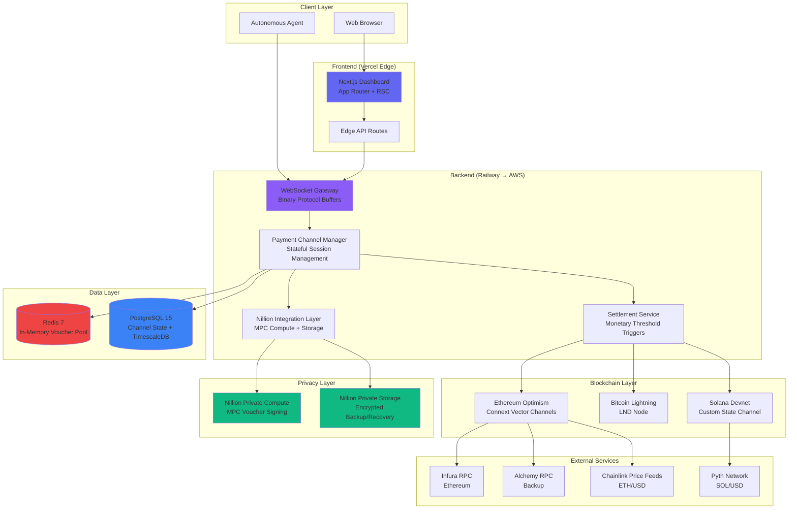

# High Level Architecture

## Technical Summary

This is a **hybrid serverless-monolithic architecture** deployed across cloud infrastructure with multi-chain blockchain integration. The system combines:

**Frontend**: Next.js 14 dashboard (App Router, RSC) deployed to Vercel edge network, serving real-time WebSocket connections to monitoring UI with <50ms client-side latency. TypeScript React components use shadcn/ui with Tailwind CSS for developer-focused data visualization.

**Backend**: Node.js monolithic server (MVP) handling WebSocket gateway, payment channel management, Nillion MPC integration, and settlement orchestration. Stateful in-memory voucher pools backed by Redis provide <1ms lookup for 1000+ pkt/sec throughput. PostgreSQL with TimescaleDB extension persists payment channel state and metrics time-series.

**Blockchain Layer**: Three parallel integrations—Ethereum Optimism (Connext Vector state channels), Bitcoin Lightning Network (LND), Solana (custom state channel program)—unified through shared Nillion MPC voucher signing. Cross-chain atomic swaps enable payment routing across all three networks.

**Privacy Layer**: Nillion Private Compute pre-signs 100 vouchers during handshake (10s one-time cost), served from memory during streaming (0.001ms). Nillion Private Storage provides crash recovery for autonomous agents, storing encrypted voucher backups in distributed MPC shares.

**Deployment**: MVP runs on Railway (cost-optimized single-region), production migrates to microservices with edge-deployed WebSocket gateway (Cloudflare Workers or AWS Lambda@Edge) and centralized payment channel manager. Monetary threshold settlements ($100/$1000) keep on-chain costs economical while maintaining privacy.

This architecture achieves the PRD's <100ms p95 latency and 1000+ pkt/sec targets while proving Nillion MPC viability at $12k/month operational cost (200× cheaper than naive per-packet MPC).

---

## Platform and Infrastructure Choice

Based on PRD requirements (rapid MVP iteration, cost constraints, future microservices migration), I evaluated three platform options:

**Option 1: Vercel + Railway + Managed Blockchain RPC**
- **Frontend**: Vercel (Next.js optimized, edge network, automatic previews)
- **Backend**: Railway (developer experience, PostgreSQL included, cost-effective $20-50/month MVP)
- **Database**: Railway PostgreSQL with TimescaleDB
- **Cache**: Railway Redis
- **Blockchain RPC**: Infura (Ethereum), Alchemy (backup), public testnet nodes (Bitcoin/Solana)
- **Pros**: Fastest time-to-deployment, lowest MVP cost (~$100/month total), excellent DX, Railway handles DB backups
- **Cons**: Vendor lock-in, harder microservices migration, single-region backend (higher latency)

**Option 2: AWS Full Stack**
- **Frontend**: AWS Amplify (Next.js hosting)
- **Backend**: ECS Fargate (containerized Node.js)
- **Database**: RDS PostgreSQL + ElastiCache Redis
- **Blockchain RPC**: Same (Infura/Alchemy)
- **Pros**: Enterprise-ready, clear microservices path (ECS → Lambda@Edge), multi-region capable
- **Cons**: Complex setup, higher cost ($300-500/month MVP), slower iteration, steeper learning curve

**Option 3: Google Cloud (Cloud Run + Firebase)**
- **Frontend**: Firebase Hosting
- **Backend**: Cloud Run (containerized)
- **Database**: Cloud SQL PostgreSQL + Memorystore Redis
- **Pros**: Good middle ground (DX + scale), Cloud Run autoscaling
- **Cons**: Less Next.js optimization than Vercel, moderate cost ($150-250/month)

---

**RECOMMENDATION: Option 1 (Vercel + Railway) for MVP, migrate to AWS/GCP for production**

**Rationale:**

1. **PRD alignment**: Technical assumptions specify Railway as preferred for "cost + DX" with "AWS/GCP acceptable"
2. **Speed to value**: Vercel + Railway deployment in <1 hour vs AWS 1-2 days setup
3. **Cost constraints**: $100/month fits within PoC budget; AWS $500/month doesn't
4. **Migration path**: Railway Docker containers transfer directly to AWS ECS/GCP Cloud Run in Week 19+
5. **Blockchain RPC agnostic**: All options use same Infura/Alchemy providers

**Platform Decision:**

| Component | Technology | Deployment Region |
|-----------|-----------|-------------------|
| **Frontend** | Vercel Edge Network | Global (CDN, edge-rendered RSC) |
| **Backend (MVP)** | Railway (us-west-1) | US West (single region) |
| **Backend (Prod)** | AWS Lambda@Edge + ECS | Multi-region (edge gateway + central manager) |
| **Database** | Railway PostgreSQL 15 + TimescaleDB | US West (MVP), RDS Multi-AZ (Prod) |
| **Cache** | Railway Redis 7 | US West (MVP), ElastiCache (Prod) |
| **Blockchain RPC** | Infura (primary), Alchemy (failover) | Provider-managed |
| **Monitoring** | Vercel Analytics + Railway metrics (MVP), Datadog (Prod) | N/A |

**Key Services:**
- **Vercel**: Next.js dashboard, edge functions for API routes
- **Railway**: Node.js WebSocket server, PostgreSQL, Redis
- **Infura**: Ethereum Optimism RPC
- **Alchemy**: Ethereum backup RPC
- **Public nodes**: Bitcoin testnet, Solana devnet (MVP only)

---

## Repository Structure

**Structure:** Turborepo monorepo with pnpm workspaces

**Rationale:**

The PRD requires six tightly coupled packages with shared TypeScript types (Nillion voucher interfaces, payment channel state) and Protocol Buffer definitions. Monorepo enables atomic commits across SDK breaking changes and unified versioning for coherent releases. A single CI/CD pipeline can test all 3 chain integrations in parallel.

**Package Organization:**

```
nillion-micropayment-protocol/          # Root
├── .github/
│   └── workflows/
│       ├── ci.yaml                     # Test all packages + apps
│       ├── deploy-dashboard.yaml       # Vercel deployment
│       └── deploy-server.yaml          # Railway deployment
├── apps/
│   ├── dashboard/                      # Next.js 14 monitoring UI
│   │   ├── src/
│   │   │   ├── app/                    # App Router pages
│   │   │   ├── components/             # Dashboard-specific components
│   │   │   └── lib/                    # Dashboard utilities
│   │   ├── public/
│   │   ├── package.json
│   │   └── next.config.js
│   ├── server/                         # Node.js backend monolith
│   │   ├── src/
│   │   │   ├── websocket/              # WebSocket gateway
│   │   │   ├── channels/               # Payment channel manager
│   │   │   ├── nillion/                # Nillion integration
│   │   │   ├── settlement/             # Settlement service
│   │   │   ├── monitoring/             # Metrics collection
│   │   │   └── index.ts                # Server entry point
│   │   ├── tests/
│   │   ├── Dockerfile
│   │   └── package.json
│   └── demo/                           # Developer integration example
│       ├── src/
│       ├── package.json
│       └── README.md
├── packages/
│   ├── client-sdk/                     # Browser/Node.js client SDK
│   │   ├── src/
│   │   │   ├── voucher/                # Voucher management
│   │   │   ├── channel/                # Channel lifecycle
│   │   │   └── index.ts
│   │   ├── tests/
│   │   └── package.json
│   ├── server-sdk/                     # Node.js server SDK
│   │   ├── src/
│   │   │   ├── verification/           # Payment verification
│   │   │   ├── settlement/             # Settlement logic
│   │   │   └── index.ts
│   │   └── package.json
│   ├── protocol/                       # Protocol Buffer schemas
│   │   ├── proto/
│   │   │   ├── voucher.proto
│   │   │   ├── payment.proto
│   │   │   └── channel.proto
│   │   ├── generated/                  # TypeScript types from protoc
│   │   └── package.json
│   ├── nillion-adapter/                # Nillion Private Compute/Storage wrapper
│   │   ├── src/
│   │   │   ├── compute/                # MPC signing
│   │   │   ├── storage/                # Backup/recovery
│   │   │   └── mock/                   # Local dev mock
│   │   └── package.json
│   ├── shared/                         # Shared utilities and types
│   │   ├── src/
│   │   │   ├── types/                  # Shared TypeScript interfaces
│   │   │   ├── constants/              # Chain IDs, contract addresses
│   │   │   └── utils/                  # Common helpers
│   │   └── package.json
│   └── config/                         # Shared configs
│       ├── eslint/
│       ├── typescript/
│       └── jest/
├── docs/                               # Documentation site (VitePress)
│   ├── prd.md
│   ├── architecture.md                 # This document
│   └── api/
├── scripts/                            # Build/deploy scripts
│   ├── setup-testnets.sh
│   └── benchmark.ts
├── turbo.json                          # Turborepo pipeline config
├── pnpm-workspace.yaml
├── package.json
└── README.md
```

**Monorepo Tool:** Turborepo 1.x

**Package Strategy:**
- **Packages are independently versioned** (semantic versioning)
- **Apps always use latest package versions** (workspace:*)
- **Shared types in `packages/shared`** prevent circular dependencies
- **Protocol package generates TypeScript** from .proto files at build time

---

## High Level Architecture Diagram



---

## Architectural Patterns

- **Jamstack Architecture (Frontend):** Static site generation with serverless API routes - _Rationale:_ Optimal performance for dashboard (CDN-cached components) with dynamic data via client-side fetch and WebSocket

- **Monolithic Modular Backend (MVP):** Single Node.js service with clear module boundaries (WebSocket/Channels/Nillion/Settlement as separate folders) - _Rationale:_ Rapid iteration during PoC development while maintaining clean separation for microservices extraction post-MVP

- **Repository Pattern (Data Access):** Abstract database operations behind interfaces in server-sdk - _Rationale:_ Enables testing with in-memory stores and future migration from PostgreSQL to distributed database if needed

- **Adapter Pattern (Nillion Integration):** `nillion-adapter` package wraps Nillion SDK with mock implementation for local development - _Rationale:_ Developers can work without Nillion API access; CI/CD tests run against mocks; production swaps in real Nillion client

- **Protocol Buffers (Wire Format):** All WebSocket messages use binary protobuf encoding - _Rationale:_ 1.3% overhead vs JSON's 30-40%, critical for 1000 pkt/sec target; schema evolution support for versioning

- **In-Memory Cache-Aside (Vouchers):** Redis caches hot vouchers with PostgreSQL as source of truth - _Rationale:_ <1ms lookup required for latency target; Redis cleared on crash, PostgreSQL enables recovery

- **Event-Driven Settlement (Backend):** Settlement service subscribes to monetary threshold events from Channel Manager - _Rationale:_ Decouples settlement logic from payment processing; enables async batch settlements

- **Backend-for-Frontend (BFF) Pattern:** Next.js Edge API routes aggregate multiple backend WebSocket streams for dashboard - _Rationale:_ Reduces client-side complexity; edge routes provide <50ms latency from dashboard to data

- **Command Query Responsibility Segregation (CQRS):** Write operations (create channel, send payment) go through WebSocket; read operations (query history, metrics) use REST API - _Rationale:_ Optimizes WebSocket for real-time writes; REST GET requests cacheable by Vercel edge

- **Circuit Breaker (External APIs):** Nillion/Infura/Alchemy calls wrapped in circuit breaker with exponential backoff - _Rationale:_ Prevents cascade failures when external services degrade; dashboard shows degraded state without crashing

---
