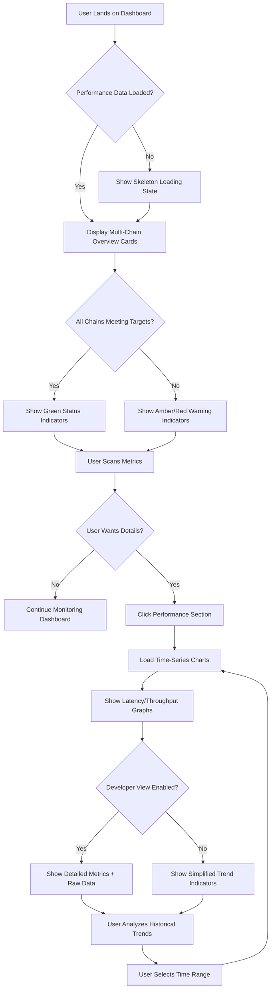
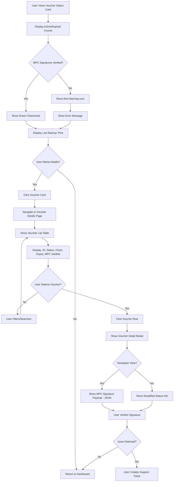
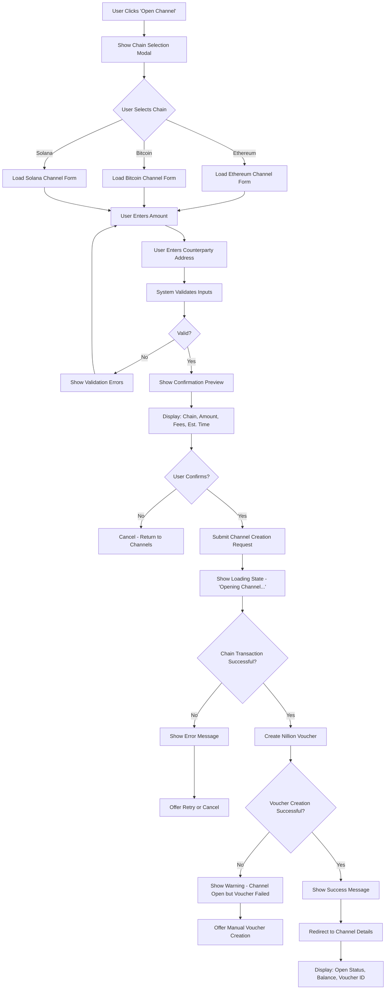
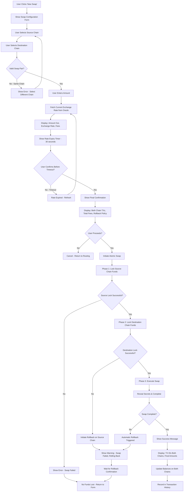

# Nillion-Powered Multi-Chain Micropayment Protocol UI/UX Specification

**Version:** 1.0
**Last Updated:** November 16, 2025
**Status:** Draft - Pending Stakeholder Review

---

## Introduction

This document defines the user experience goals, information architecture, user flows, and visual design specifications for **Nillion-Powered Multi-Chain Micropayment Protocol**'s user interface. It serves as the foundation for visual design and frontend development, ensuring a cohesive and user-centered experience.

---

## 1. Overall UX Goals & Principles

### 1.1 Target User Personas

#### **Persona 1: Nillion Agent Developer**
- **Profile:** Highly technical, building privacy-preserving M2M applications
- **Needs:** Real-time debugging, performance metrics, MPC signature verification
- **Pain Points:** Complex multi-chain coordination, privacy guarantees verification
- **Success Metric:** Can monitor 1000+ pkt/sec across 3 chains with <100ms latency visibility

#### **Persona 2: API Integration Developer**
- **Profile:** Moderate technical skill, integrating micropayment protocol into existing apps
- **Needs:** Clear SDK documentation, simple integration patterns, unified API abstraction
- **Pain Points:** Multi-chain complexity, state channel management
- **Success Metric:** Complete integration within 1 day using SDK

#### **Persona 3: Privacy-Conscious Enterprise User**
- **Profile:** Business decision-maker, GDPR/HIPAA compliance focused
- **Needs:** Privacy audit trails, settlement verification, compliance reporting
- **Pain Points:** Regulatory compliance, financial reconciliation
- **Success Metric:** Generate compliance reports showing MPC privacy guarantees

#### **Persona 4: System Administrator**
- **Profile:** DevOps/infrastructure role, managing production deployments
- **Needs:** System health monitoring, error alerting, performance dashboards
- **Pain Points:** Multi-chain observability, crash recovery validation
- **Success Metric:** Detect and respond to issues within 1 minute

---

### 1.2 Usability Goals

1. **Ease of Learning:** New developers can understand the dashboard and locate key metrics within 2 minutes
2. **Efficiency of Use:** Power users can access any critical metric within 2 clicks from the main dashboard
3. **Error Prevention:** All destructive actions (channel closure, cross-chain swaps) require explicit confirmation with impact preview
4. **Transparency:** Complete visibility into MPC operations, voucher status, and cross-chain routing without exposing private data
5. **Performance Clarity:** Real-time indication when system falls below performance targets (<100ms latency, 1000 pkt/sec)
6. **Multi-Chain Abstraction:** Users can monitor all 3 chains through a unified interface without switching contexts

---

### 1.3 Design Principles

1. **Privacy-First Transparency** - Show operation status and verification without exposing sensitive MPC data
2. **Performance at a Glance** - Critical metrics (latency, throughput) visible without scrolling on all views
3. **Chain-Agnostic UX** - Users shouldn't need to understand Ethereum, Bitcoin, or Solana specifics to use the dashboard
4. **Developer and User Duality** - Every view toggles between simplified (user) and detailed (developer) modes
5. **Real-Time Confidence** - All data updates live; stale data is clearly marked with warnings

---

### 1.4 Change Log

| Date | Version | Description | Author |
|------|---------|-------------|---------|
| 2025-11-16 | 1.0 | Initial specification created | Sally (UX Expert) |

---

## 2. Information Architecture (IA)

### 2.1 Site Map / Screen Inventory

```mermaid
graph TD
    A[Dashboard Home] --> B[Multi-Chain Overview]
    A --> C[Channel Management]
    A --> D[Cross-Chain Routing]
    A --> E[Transaction History]
    A --> F[Performance Monitoring]
    A --> G[Alerts & Notifications]
    A --> H[Settings]

    B --> B1[Ethereum Optimism Status]
    B --> B2[Bitcoin Lightning Status]
    B --> B3[Solana Status]
    B --> B4[Nillion Voucher Status]

    C --> C1[All Channels View]
    C --> C2[Ethereum Channels]
    C --> C3[Bitcoin Channels]
    C --> C4[Solana Channels]
    C --> C5[Channel Details]
    C5 --> C5a[Channel Lifecycle]
    C5 --> C5b[Balance & Capacity]
    C5 --> C5c[Activity Log]

    D --> D1[Route Visualization]
    D --> D2[BTC ↔ ETH Swaps]
    D --> D3[BTC ↔ SOL Swaps]
    D --> D4[ETH ↔ SOL Swaps]
    D --> D5[Exchange Rate Oracle]

    E --> E1[All Transactions]
    E --> E2[Payments]
    E --> E3[Settlements]
    E --> E4[Cross-Chain Swaps]
    E --> E5[Transaction Details]
    E5 --> E5a[MPC Signature Verification]
    E5 --> E5b[Raw Logs - Developer View]

    F --> F1[Latency Metrics]
    F --> F2[Throughput Metrics]
    F --> F3[Success Rate Analytics]
    F --> F4[Historical Performance]

    G --> G1[Active Alerts]
    G --> G2[Alert History]
    G --> G3[Notification Preferences]

    H --> H1[User Profile]
    H --> H2[API Keys]
    H --> H3[View Mode Toggle]
    H --> H4[Dark Mode Preference]
    H --> H5[Alert Configuration]
```



---

### 2.2 Navigation Structure

**Primary Navigation:**
- Top horizontal navigation bar (desktop) / Bottom tab bar (mobile)
- Always visible, sticky positioning
- Items: Dashboard, Channels, Routing, Transactions, Performance, Alerts
- Settings accessible via profile icon (top-right)
- View Mode Toggle (Developer/User) prominent in top-right corner

**Secondary Navigation:**
- Tab-based navigation within each primary section
- Example: Within "Channels" → tabs for [All | Ethereum | Bitcoin | Solana]
- Example: Within "Transactions" → tabs for [All | Payments | Settlements | Swaps]
- Filters and search appear above content, below tabs

**Breadcrumb Strategy:**
- Breadcrumbs shown only for deep navigation (3+ levels)
- Example: `Dashboard > Channels > Ethereum > Channel #abc123`
- Mobile: Collapse breadcrumbs to back button with context label
- Clicking breadcrumb items allows quick navigation to parent sections

---

## 3. User Flows

### 3.1 Flow 1: Monitor Real-Time Performance Across All Chains

**User Goal:** Quickly verify that the system is meeting performance targets (<100ms latency, 1000 pkt/sec throughput) across all 3 blockchains

**Entry Points:**
- Dashboard home page (primary)
- Performance section from main navigation
- Alert notification about performance degradation

**Success Criteria:**
- User can see current latency and throughput within 2 seconds of page load
- User can identify which chain (if any) is underperforming
- User receives visual confirmation (green indicators) when targets are met

#### Flow Diagram



#### Edge Cases & Error Handling:
- **Stale data (>5 seconds old):** Display amber "Last updated X seconds ago" warning
- **WebSocket connection lost:** Show red banner "Live updates paused - Reconnecting..."
- **Partial chain data failure:** Show available chains, mark failed chain with error state
- **Performance breach during viewing:** Real-time alert notification slides in from top
- **No historical data available:** Display "Insufficient data" message with collection start time

**Notes:** This is the highest priority flow as it directly maps to Epic 5's "unified monitoring dashboard" and validates the core performance claims (<100ms, 1000 pkt/sec)

---

### 3.2 Flow 2: Investigate and Verify MPC Voucher Status

**User Goal:** Verify that Nillion MPC vouchers are active, properly signed, and backed up (critical for privacy guarantees)

**Entry Points:**
- Dashboard home "Nillion Voucher Status" card
- Alert notification about voucher expiration
- Channel details page (to verify voucher for specific channel)

**Success Criteria:**
- User can see count of active vs expired vouchers
- User can verify MPC signature status (green check = verified)
- User can confirm last backup timestamp to Nillion Private Storage

#### Flow Diagram



#### Edge Cases & Error Handling:
- **MPC verification fails:** Display detailed error message with troubleshooting steps
- **Backup timestamp >24 hours old:** Show amber warning "Backup overdue"
- **All vouchers expired:** Show critical alert banner on dashboard
- **Nillion service unreachable:** Display "Unable to verify MPC status" with retry button
- **Mixed verification states:** Show summary "X of Y verified" with drill-down option

**Notes:** This flow is unique to Nillion integration and critical for trust/security. Maps to Epic 1 success criteria #3 (Privacy validation - MPC signatures)

---

### 3.3 Flow 3: Open and Fund a Payment Channel (Multi-Chain)

**User Goal:** Create a new payment channel on a specific blockchain (Ethereum, Bitcoin, or Solana) and fund it

**Entry Points:**
- Channel Management section → "New Channel" button
- Dashboard quick action → "Open Channel"
- Empty state in channel list

**Success Criteria:**
- User successfully creates channel on chosen blockchain
- Channel is funded with specified amount
- Channel status shows "Open" with correct balance
- Nillion voucher is created and verified for the channel

#### Flow Diagram



#### Edge Cases & Error Handling:
- **Insufficient wallet balance:** Show error before submission with current balance
- **Network congestion (high fees):** Warn user and show estimated wait time
- **Partial failure (channel opens but voucher fails):** Allow retry voucher creation
- **Counterparty address invalid:** Validate format before submission
- **User cancels during transaction:** Show warning about potential gas loss
- **Timeout during blockchain confirmation:** Poll status and update UI when confirmed

**Notes:** This flow spans Epic 1-3 (all 3 chains) and involves Nillion voucher creation (Epic 1). Different chains have different UX considerations (Lightning channel capacity, Solana rent-exemption)

---

### 3.4 Flow 4: Execute Cross-Chain Swap (Atomic)

**User Goal:** Swap funds from one blockchain to another using cross-chain routing (e.g., BTC → ETH)

**Entry Points:**
- Cross-Chain Routing section → "New Swap" button
- Channel details → "Cross-Chain Transfer" action
- Dashboard quick action

**Success Criteria:**
- User successfully initiates atomic swap between 2 chains
- Exchange rate is locked in at initiation
- Swap completes or fully rolls back (no partial states)
- User receives confirmation with transaction IDs on both chains

#### Flow Diagram



#### Edge Cases & Error Handling:
- **Exchange rate moves during confirmation:** Warn user, require re-confirmation
- **Partial failure (locked but not completed):** Automatic rollback with user notification
- **Network timeout on one chain:** Extend timeout window, show progress indicator
- **Insufficient balance after fees:** Calculate fees upfront and validate before submission
- **Rollback fails:** Escalate to manual recovery process with support ticket
- **User loses connection mid-swap:** Swap continues in background, status shown on reconnect

**Notes:** This is the most complex flow, implementing Epic 4 (Cross-Chain Payment Routing). Critical that rollback mechanism is clear to users to build trust. Privacy must be maintained through MPC signatures on both chains.

---

## 4. Wireframes & Mockups

### 4.1 Primary Design Files

**Primary Design Files:** To be created in Figma (recommended for component-based design system and developer handoff)

**Recommended Figma Structure:**
- **Page 1:** Design System (colors, typography, components)
- **Page 2:** Desktop Layouts (1440px viewport)
- **Page 3:** Tablet Layouts (768px viewport)
- **Page 4:** Mobile Layouts (375px viewport)
- **Page 5:** User Flows (interactive prototypes)
- **Page 6:** Developer View Variants

**Design File Link:** [To be created - placeholder]

---

### 4.2 Key Screen Layouts

#### Screen 1: Dashboard Home (Multi-Chain Overview)

**Purpose:** Primary landing page showing system health across all 3 chains, performance metrics, and voucher status at a glance

**Key Elements:**
- **Top Navigation Bar**
  - Logo/title "Nillion Micropayment Protocol"
  - Main navigation: Dashboard (active), Channels, Routing, Transactions, Performance, Alerts
  - Right side: View toggle (Developer/User), Dark mode toggle, Profile icon

- **Hero Metrics Row** (3 cards, horizontal on desktop, stacked on mobile)
  - Card 1: Real-Time Performance
    - Current latency (ms) with color-coded indicator vs 100ms target
    - Current throughput (pkt/sec) with indicator vs 1000 target
    - Success rate percentage
    - Small sparkline charts (last 20 data points)

  - Card 2: Multi-Chain Status
    - 3 sub-sections (Ethereum, Bitcoin, Solana)
    - Each shows: Chain logo, status badge, channel count, total balance
    - Color-coded by chain (Red/Orange/Purple accents)

  - Card 3: Nillion Voucher Status
    - Active voucher count (large number)
    - Expired voucher count (smaller, muted)
    - MPC verification status (green check or red warning)
    - Last backup timestamp (relative time)

- **Secondary Content Row** (2 columns on desktop, stacked on mobile)
  - Left: Recent Transactions (table or list)
    - Shows last 5 transactions
    - Columns: Time, Type badge, Amount, Chain(s), Status
    - "View All" link to Transaction History

  - Right: Active Alerts Panel
    - List of current warnings/errors
    - Each alert: Icon, message, timestamp, dismiss button
    - Filter: All / Errors / Warnings
    - "View History" link

- **Quick Actions** (Floating action button on mobile)
  - "Open Channel" button
  - "New Swap" button (if channels exist)

**Interaction Notes:**
- All cards have subtle hover states on desktop
- Clicking any metric card navigates to detailed view
- Real-time updates show subtle pulse animation on change
- Loading states use skeleton screens matching final layout
- Empty states show friendly illustrations with "Get Started" CTA

**Design File Reference:** `Figma → Page 2 (Desktop) → Frame: "Dashboard-Home-Desktop"`

---

#### Screen 2: Channel Management (Tabbed Table View)

**Purpose:** View and manage all payment channels across all 3 blockchains with filtering and search

**Key Elements:**
- **Page Header**
  - Title: "Channel Management"
  - Right side: "Open New Channel" primary button
  - Search input (icon + placeholder "Search by channel ID, chain...")

- **Tab Navigation**
  - Tabs: All Chains (badge count), Ethereum (count), Bitcoin (count), Solana (count)
  - Active tab underlined with chain accent color

- **Filter Bar** (below tabs)
  - Dropdown: Status (All, Open, Closed, Pending)
  - Dropdown: Balance range (All, <$100, $100-$1000, >$1000)
  - Clear filters link

- **Channel Table** (Desktop)
  - Columns:
    - Channel ID (truncated with copy button)
    - Chain (badge with logo)
    - Status (color-coded badge: Open=green, Closed=gray, Pending=amber)
    - Balance (with currency symbol)
    - Capacity (with utilization bar)
    - Last Activity (relative time)
    - Actions (dropdown menu icon)
  - Row hover highlights entire row
  - Sortable columns (click header to sort)
  - Pagination at bottom (showing "X-Y of Z channels")

- **Mobile: Card List View**
  - Each channel as a card with:
    - Top: Chain badge + Status badge
    - Channel ID (truncated) with copy icon
    - Balance (large) / Capacity (smaller, below)
    - Last Activity + Actions menu (3-dot icon)
  - Swipe left on card reveals "Close Channel" action
  - Pull-to-refresh for updates

- **Empty State** (if no channels)
  - Illustration (empty state graphic)
  - Heading: "No payment channels yet"
  - Subtext: "Open your first channel to start making micropayments"
  - "Open Channel" CTA button

**Interaction Notes:**
- Clicking row/card navigates to Channel Details page
- Actions menu: View Details, Close Channel, Export Data
- Close Channel shows confirmation modal with impact preview
- Search filters in real-time as user types
- Tab counts update live as channels open/close

**Design File Reference:** `Figma → Page 2 (Desktop) → Frame: "Channels-Table-Desktop"` & `Page 4 (Mobile) → Frame: "Channels-List-Mobile"`

---

#### Screen 3: Cross-Chain Routing Visualization

**Purpose:** Visual representation of cross-chain swap routes and status, with ability to initiate new swaps

**Key Elements:**
- **Page Header**
  - Title: "Cross-Chain Routing"
  - Right side: "New Swap" primary button

- **Network Graph Visualization** (Desktop)
  - 3 circular nodes representing chains (large circles)
    - Ethereum node (red accent, OP logo)
    - Bitcoin node (orange accent, Lightning logo)
    - Solana node (purple/violet accent, SOL logo)
  - Connecting lines between all 3 pairs:
    - BTC ↔ ETH (diagonal line)
    - BTC ↔ SOL (diagonal line)
    - ETH ↔ SOL (bottom line)
  - Line styles:
    - Solid green = Route active, recent swaps
    - Dashed gray = Route available, no recent activity
    - Red = Route unavailable/degraded
  - Hover on line shows tooltip:
    - Last swap: timestamp
    - Success rate: percentage
    - Current exchange rate

- **Mobile: Route Cards List**
  - 3 cards, one per swap pair
  - Each card shows:
    - Source chain → Destination chain (with logos)
    - Status indicator (active/inactive)
    - Last swap timestamp
    - Success rate (with trend arrow)
    - "Swap Now" button

- **Route Details Panel** (Desktop: Right sidebar, Mobile: Bottom sheet)
  - Shows details for selected route
  - Exchange Rate Oracle status
  - Recent swap history (last 5 on this route)
  - Average swap time
  - Fee estimate

- **Developer View Additions**
  - Route discovery algorithm status
  - Liquidity metrics per route
  - Failed swap attempts log
  - Rate oracle API latency

**Interaction Notes:**
- Clicking node highlights all connected routes
- Clicking line/route opens details panel
- "New Swap" button opens swap configuration modal
- Real-time updates animate line color changes
- Graph auto-arranges on resize (responsive)

**Design File Reference:** `Figma → Page 2 (Desktop) → Frame: "Routing-Graph-Desktop"` & `Page 4 (Mobile) → Frame: "Routing-Cards-Mobile"`

---

#### Screen 4: Performance Monitoring Dashboard

**Purpose:** Detailed time-series charts showing latency, throughput, and success rate over time with historical analysis

**Key Elements:**
- **Page Header**
  - Title: "Performance Monitoring"
  - Time Range Selector: Last 1h (active), 6h, 24h, 7d
  - Right side: Export CSV, Refresh button

- **Target Metrics Summary** (sticky header below page header)
  - 3 inline metrics with large numbers:
    - Current Latency: XXms (with up/down arrow trend)
    - Current Throughput: XXXXpkt/sec (with trend)
    - Success Rate: XX.X% (with trend)
  - Each has color coding: green <target, amber near target, red >target

- **Chart Section 1: Latency Over Time** (Line chart)
  - X-axis: Time (intervals based on selected range)
  - Y-axis: Latency in milliseconds
  - Horizontal reference line at 100ms (dashed, labeled "Target")
  - Color zones:
    - Green zone (0-100ms)
    - Amber zone (100-200ms)
    - Red zone (200ms+)
  - Data line color changes based on zone
  - Tooltip on hover: Exact timestamp, latency value
  - Legend: Current, Target threshold

- **Chart Section 2: Throughput Over Time** (Area chart)
  - X-axis: Time
  - Y-axis: Packets/second
  - Horizontal reference line at 1000 pkt/sec
  - Filled area below line (gradient from accent color to transparent)
  - Tooltip: Timestamp, throughput value

- **Chart Section 3: Success Rate** (Bar chart)
  - X-axis: Time buckets (15-min intervals)
  - Y-axis: Success percentage (0-100%)
  - Bars color-coded: green >95%, amber 90-95%, red <90%
  - Tooltip: Time range, success rate, total transactions

- **Developer View: Additional Metrics**
  - Chain-specific breakdowns (toggle to show per-chain lines)
  - P50/P95/P99 latency percentiles
  - Error type breakdown table
  - Network/Nillion/Blockchain latency attribution

- **Mobile Simplified View**
  - Show only current metrics (no charts)
  - Trend indicators: ↑↓→ with color
  - "View Charts" button expands to full chart view

**Interaction Notes:**
- Charts zoom on pinch (mobile) or scroll (desktop)
- Click time range button to update all charts simultaneously
- Charts show loading skeleton during data fetch
- If no data for selected range, show "Insufficient data" message
- Real-time mode: Charts update every 3 seconds with smooth transition

**Design File Reference:** `Figma → Page 2 (Desktop) → Frame: "Performance-Charts-Desktop"`

---

#### Screen 5: Transaction Details Modal (MPC Verification)

**Purpose:** Detailed view of a single transaction showing all metadata, chain confirmations, and MPC signature verification

**Key Elements:**
- **Modal Header**
  - Title: "Transaction Details"
  - Transaction ID (full, with copy button)
  - Close button (X, top-right)

- **Status Banner** (top of modal content)
  - Large status badge: Success (green), Pending (amber), Failed (red)
  - Timestamp (full datetime)
  - Transaction type badge: Payment / Settlement / Swap

- **Key Information Grid** (2-column on desktop, stacked on mobile)
  - Amount (large, bold)
  - Chain(s) involved (badges)
  - From Address (truncated, copy button)
  - To Address (truncated, copy button)
  - Fee paid
  - Block confirmations (with progress indicator if pending)

- **MPC Signature Verification Section**
  - Heading: "Nillion MPC Signature"
  - Verification status: ✓ Verified (green) or ✗ Failed (red)
  - Voucher ID (link to voucher details)
  - Signature timestamp
  - **Developer View Only:**
    - "View Raw Signature" expandable section
    - JSON payload in code block with syntax highlighting
    - Copy button for payload

- **Timeline Section** (vertical timeline)
  - Event 1: Transaction initiated (timestamp)
  - Event 2: MPC signature created (timestamp)
  - Event 3: Blockchain confirmation (timestamp, block number)
  - Event 4: Settlement complete (timestamp)
  - Each event has icon and description

- **Cross-Chain Swap Specific** (if applicable)
  - Shows 2-column layout for both chains
  - Links to block explorers (Etherscan, mempool.space, Solscan)
  - Atomic swap status: Locked → Executed → Completed

- **Actions Footer**
  - "Export as JSON" button
  - "View on Block Explorer" button (opens external)
  - "Report Issue" button (if failed/pending)

**Interaction Notes:**
- Modal overlays current page with dark backdrop
- Click outside modal or ESC key to close
- Copy buttons show "Copied!" toast on click
- Raw JSON section has syntax highlighting and collapsible
- Links to block explorers open in new tab

**Design File Reference:** `Figma → Page 2 (Desktop) → Frame: "Transaction-Modal-Desktop"`

---

## 5. Component Library / Design System

### 5.1 Design System Approach

**Design System Approach:** Use **shadcn/ui** as the foundation component library with Tailwind CSS for styling. This approach provides:

- **Pre-built accessible components** that follow WAI-ARIA guidelines out of the box
- **Radix UI primitives** underneath for robust interaction patterns
- **Copy-paste customization** (components live in your codebase, not node_modules)
- **TypeScript-first** with excellent type safety
- **Minimal bundle size** (tree-shakeable, only import what you use)
- **Easy theming** via CSS variables aligned with Tailwind

**Rationale:** shadcn/ui is ideal for a technical dashboard because:
1. Developer-friendly (matches your primary user persona)
2. Highly customizable without fighting the framework
3. Dark mode built-in via next-themes integration
4. Active community and excellent documentation
5. Works seamlessly with the Next.js + TypeScript + Tailwind stack already chosen

**Custom Components Strategy:**
- Use shadcn/ui for foundational elements (buttons, cards, tables, modals)
- Build domain-specific components on top (ChainStatusCard, PerformanceChart, VoucherBadge)
- Create a `/components/ui` directory for shadcn components
- Create a `/components/dashboard` directory for custom domain components

---

### 5.2 Core Components

#### Component 1: ChainBadge

**Purpose:** Consistent visual representation of blockchain types throughout the interface

**Variants:**
- `ethereum` - Red accent (#FF0420), Optimism logo
- `bitcoin` - Orange accent (#F7931A), Lightning bolt icon
- `solana` - Purple gradient accent (#14F195 to #9945FF), SOL logo
- `size`: `sm` (16px), `md` (24px default), `lg` (32px)

**States:**
- Default - Normal opacity, colored background
- Disabled - Reduced opacity (40%), grayscale
- Active - Brighter glow effect on hover
- Loading - Skeleton shimmer animation

**Usage Guidelines:**
- Always pair with chain name in text for accessibility
- Use `sm` size in table cells, `md` in cards, `lg` in headers
- Include aria-label with full chain name
- Never use badge alone without context

---

#### Component 2: StatusIndicator

**Purpose:** Universal status display for channels, transactions, vouchers, and system health

**Variants:**
- `success` - Green (#10B981), checkmark icon
- `warning` - Amber (#F59E0B), alert triangle icon
- `error` - Red (#EF4444), X circle icon
- `pending` - Blue (#3B82F6), spinner icon
- `inactive` - Gray (#6B7280), circle icon

**States:**
- Static - Icon only, no animation
- Animated - Pulsing for pending/loading states
- With label - Icon + text label (e.g., "Active", "Failed")
- Inline - Smaller size for inline text (e.g., "Status: • Active")

**Usage Guidelines:**
- Use `success` for completed/verified/active states
- Use `warning` for degraded performance or upcoming expirations
- Use `error` for failures or critical issues
- Use `pending` for in-progress operations (show spinner)
- Always include text label for screen readers (can be visually hidden)
- Pending states must have animated spinner for feedback

---

#### Component 3: MetricCard

**Purpose:** Display key performance metrics with trend indicators and sparklines

**Variants:**
- `performance` - Shows numeric metric with target comparison (latency, throughput)
- `status` - Shows count or state with icon (active channels, vouchers)
- `chart` - Includes mini sparkline chart showing trend
- `compact` - Reduced padding for dense layouts

**States:**
- Loading - Skeleton loader matching card dimensions
- Normal - Standard display with all data
- Alert - Red/amber border when metric exceeds threshold
- Empty - "No data available" message with muted styling

**Usage Guidelines:**
- Use consistent sizing: 300px min width on desktop
- Stack vertically on mobile (full width)
- Always show units (ms, pkt/sec, %, etc.)
- Include trend indicator (↑↓→) when showing time-series data
- Use sparklines sparingly (max 3 per viewport to avoid clutter)
- Alert state should be obvious but not alarming (subtle border, not flashing)

---

#### Component 4: ChainSelector

**Purpose:** Allow users to filter or select blockchain in forms and views

**Variants:**
- `dropdown` - Dropdown menu with chain options (default)
- `tabs` - Horizontal tabs for switching between chains
- `radio` - Radio button group for forms
- `multi-select` - Checkboxes for filtering multiple chains

**States:**
- All selected - "All Chains" option active
- Single selected - One chain active with accent color
- Multiple selected - Badge count showing "3 selected"
- Disabled option - Grayed out if chain unavailable

**Usage Guidelines:**
- Use `tabs` variant for primary navigation (Channel Management page)
- Use `dropdown` for forms and filters
- Use `multi-select` for advanced filtering only
- Always include "All Chains" option when applicable
- Show chain logo + name together (not logo alone)
- Maintain chain accent colors consistently

---

#### Component 5: PerformanceChart

**Purpose:** Reusable time-series chart for displaying latency, throughput, and success metrics

**Variants:**
- `line` - Line chart (for latency)
- `area` - Area chart (for throughput)
- `bar` - Bar chart (for success rate)
- `multi-line` - Multiple lines on one chart (chain comparison)

**States:**
- Loading - Skeleton chart with axis placeholders
- Normal - Chart with data rendered
- Empty - "No data for selected time range" message
- Error - "Unable to load chart data" with retry button

**Usage Guidelines:**
- Always include target threshold lines (100ms, 1000pkt/sec)
- Use color zones for performance ranges (green/amber/red)
- Show tooltip on hover with exact values
- Include time range selector above chart
- Responsive: Full width on mobile, hide Y-axis labels if <400px wide
- Update smoothly with CSS transitions (300ms) on data change
- Max 20 data points on mobile, 100 on desktop (for performance)

---

#### Component 6: TransactionTable

**Purpose:** Tabular display of transactions with sorting, filtering, and pagination

**Variants:**
- `full` - All columns visible (desktop)
- `compact` - Essential columns only (tablet)
- `list` - Card-based list view (mobile)

**States:**
- Loading - Skeleton rows (5 rows)
- Populated - Data rendered with hover states
- Empty - "No transactions found" with illustration
- Filtered - Shows active filter badges above table

**Usage Guidelines:**
- Desktop: Show all columns with sortable headers
- Tablet: Hide "Last Activity" column
- Mobile: Convert to card list automatically at <640px
- Always show pagination if >20 items
- Include search/filter controls above table
- Clicking row navigates to transaction details
- Use sticky header on scroll (desktop only)
- Alternate row background for readability (subtle zebra striping)

---

#### Component 7: VoucherVerificationBadge

**Purpose:** Display Nillion MPC voucher verification status with visual trust indicators

**Variants:**
- `verified` - Green checkmark, "MPC Verified"
- `unverified` - Red X, "Verification Failed"
- `pending` - Blue spinner, "Verifying..."
- `expired` - Gray icon, "Voucher Expired"

**States:**
- Default - Badge only
- With timestamp - Shows verification time
- With details - Expandable to show voucher ID
- Interactive - Clickable to view full signature details (developer view)

**Usage Guidelines:**
- Use prominently on transaction details and channel status
- `verified` state should be visually trustworthy (solid green, checkmark)
- `unverified` state should trigger investigation (prominent red)
- `pending` state should animate to show active process
- Always show timestamp in developer view
- Clicking opens verification details modal (developer view only)
- Include tooltip explaining MPC verification on hover

---

#### Component 8: AlertNotification

**Purpose:** Toast/banner notification for system alerts, errors, and confirmations

**Variants:**
- `toast` - Temporary notification (auto-dismiss after 5s)
- `banner` - Persistent notification (requires user dismiss)
- `inline` - Embedded in page context (e.g., form validation)

**States:**
- `error` - Red background, destructive styling
- `warning` - Amber background, cautionary styling
- `info` - Blue background, neutral styling
- `success` - Green background, positive styling

**Usage Guidelines:**
- Use `toast` for non-critical updates (channel opened, data refreshed)
- Use `banner` for critical issues (connection lost, performance degraded)
- Use `inline` for form validation errors
- Auto-dismiss after 5s for success/info, 10s for warning, never for error
- Include dismiss button (X) on all variants
- Stack toasts vertically (max 3 visible at once)
- Position: Top-right on desktop, top-center on mobile
- Must be keyboard accessible (focus on appear, ESC to dismiss)
- Include icon matching severity level

---

## 6. Branding & Style Guide

### 6.1 Visual Identity

**Brand Guidelines:** To be created as part of this project (no existing brand guidelines)

**Design Philosophy:**
- **Technical Excellence** - Clean, precise, data-driven aesthetic that appeals to developers
- **Privacy-First** - Visual language that conveys security and trustworthiness
- **Multi-Chain Harmony** - Distinct chain identities that coexist without clashing
- **Minimalist Clarity** - Remove all non-essential decoration, maximize information density

---

### 6.2 Color Palette

| Color Type | Hex Code | Usage |
|------------|----------|-------|
| **Primary** | `#6366F1` (Indigo) | Primary actions, links, brand accent |
| **Secondary** | `#8B5CF6` (Purple) | Secondary actions, Nillion-specific elements |
| **Accent - Ethereum** | `#FF0420` (Red) | Ethereum Optimism chain indicator, badges |
| **Accent - Bitcoin** | `#F7931A` (Orange) | Bitcoin Lightning chain indicator, badges |
| **Accent - Solana** | `#9945FF` (Violet) | Solana chain indicator, badges (can use gradient with #14F195) |
| **Success** | `#10B981` (Emerald) | Positive feedback, confirmations, verified states, performance targets met |
| **Warning** | `#F59E0B` (Amber) | Cautions, important notices, approaching thresholds |
| **Error** | `#EF4444` (Red) | Errors, destructive actions, failed states, critical alerts |
| **Neutral - Text** | `#0F172A` (Slate 900) | Primary text color (light mode) |
| **Neutral - Text Muted** | `#64748B` (Slate 500) | Secondary text, labels, timestamps |
| **Neutral - Background** | `#FFFFFF` (White) | Page background (light mode) |
| **Neutral - Surface** | `#F8FAFC` (Slate 50) | Card/panel background (light mode) |
| **Neutral - Border** | `#E2E8F0` (Slate 200) | Borders, dividers, table lines |
| **Dark - Background** | `#0F172A` (Slate 900) | Page background (dark mode) |
| **Dark - Surface** | `#1E293B` (Slate 800) | Card/panel background (dark mode) |
| **Dark - Text** | `#F1F5F9` (Slate 100) | Primary text (dark mode) |
| **Dark - Border** | `#334155` (Slate 700) | Borders (dark mode) |

**Color Usage Notes:**
- Chain accent colors should never be used for status indicators (avoid confusion)
- Success/Warning/Error colors are universal across light and dark modes
- Gradients allowed only for Solana branding (`linear-gradient(135deg, #9945FF 0%, #14F195 100%)`)
- All colors meet WCAG AA contrast requirements (4.5:1 for text)

---

### 6.3 Typography

#### Font Families

- **Primary:** `Inter` (Variable font) - Clean, modern sans-serif optimized for UI
- **Secondary:** `Inter` (same as primary for consistency)
- **Monospace:** `JetBrains Mono` - For transaction IDs, addresses, code blocks, JSON payloads

**Font Loading Strategy:**
- Use `next/font/google` for optimized loading
- Variable font for Inter to support weight range (400-700)
- Fallback stack: `system-ui, -apple-system, sans-serif`

#### Type Scale

| Element | Size | Weight | Line Height |
|---------|------|--------|-------------|
| **H1** | `36px` (2.25rem) | `700` (Bold) | `40px` (1.11) |
| **H2** | `30px` (1.875rem) | `600` (Semibold) | `36px` (1.2) |
| **H3** | `24px` (1.5rem) | `600` (Semibold) | `32px` (1.33) |
| **H4** | `20px` (1.25rem) | `600` (Semibold) | `28px` (1.4) |
| **Body** | `16px` (1rem) | `400` (Regular) | `24px` (1.5) |
| **Body Small** | `14px` (0.875rem) | `400` (Regular) | `20px` (1.43) |
| **Caption** | `12px` (0.75rem) | `400` (Regular) | `16px` (1.33) |
| **Label** | `14px` (0.875rem) | `500` (Medium) | `20px` (1.43) |
| **Button** | `16px` (1rem) | `500` (Medium) | `24px` (1.5) |
| **Monospace** | `14px` (0.875rem) | `400` (Regular) | `20px` (1.43) |

**Typography Usage Guidelines:**
- H1: Page titles only (one per page)
- H2: Major section headings
- H3: Card titles, subsection headings
- H4: Small section headings within cards
- Body: Default text for content
- Body Small: Table cells, form helper text
- Caption: Timestamps, metadata, fine print
- Label: Form labels, metric labels
- Monospace: Transaction IDs, wallet addresses, JSON data

---

### 6.4 Iconography

**Icon Library:** `lucide-react` (https://lucide.dev)

**Icon Sizing:**
- Small: 16px (inline with text, table cells)
- Medium: 24px (default, buttons, cards)
- Large: 32px (page headers, empty states)

**Usage Guidelines:**
- Use outline style consistently (lucide's default)
- Icon color should match adjacent text color
- Always pair icons with text labels (text can be visually hidden for accessibility)
- Status icons: circle-check (success), alert-triangle (warning), x-circle (error), loader (pending)
- Chain icons: Use custom SVG logos for Ethereum/Bitcoin/Solana
- Navigation icons: home, layers, shuffle, list, activity, bell, settings
- Action icons: plus, edit, trash-2, copy, external-link, download
- Never use decorative icons without semantic meaning

**Custom Chain Logos:**
- Ethereum Optimism: Official OP logo (red circle with white ⊙ symbol)
- Bitcoin Lightning: Lightning bolt icon in orange
- Solana: Official Solana logo (gradient "S" symbol)
- Nillion: Official Nillion logo/wordmark (to be provided by brand team)

---

### 6.5 Spacing & Layout

**Grid System:**
- 12-column grid on desktop (1440px max-width container)
- 8-column grid on tablet (768px)
- 4-column grid on mobile (375px minimum)
- Gutter width: 24px (desktop), 16px (mobile)
- Container padding: 32px (desktop), 16px (mobile)

**Spacing Scale:** (Based on Tailwind's default scale)
- `4px` (0.25rem) - Minimal spacing between related elements
- `8px` (0.5rem) - Tight spacing (icon to label)
- `12px` (0.75rem) - Compact spacing (form fields)
- `16px` (1rem) - Standard spacing (card padding, list items)
- `24px` (1.5rem) - Section spacing (between cards)
- `32px` (2rem) - Major section spacing
- `48px` (3rem) - Page section dividers
- `64px` (4rem) - Hero section spacing

**Layout Principles:**
- **Consistent padding:** All cards use 24px padding (16px on mobile)
- **Vertical rhythm:** Use 8px baseline grid for vertical spacing
- **Whitespace:** Never reduce spacing below scale to "fit more in"
- **Responsive breakpoints:**
  - Mobile: <640px
  - Tablet: 640px - 1024px
  - Desktop: 1024px - 1440px
  - Wide: >1440px

**Component Spacing Rules:**
- Gap between cards in grid: 24px
- Gap between table rows: 0 (use borders)
- Gap between form fields: 16px
- Gap between buttons in button group: 8px
- Margin below section headings: 16px
- Padding inside buttons: 12px vertical, 24px horizontal

---

### 6.6 Elevation & Shadows

**Shadow Scale:** (for depth and layering)
- **None:** `shadow-none` - Flush elements (table cells)
- **Small:** `shadow-sm` - Subtle lift (cards at rest)
  - `0 1px 2px 0 rgba(0, 0, 0, 0.05)`
- **Medium:** `shadow-md` - Standard elevation (dropdowns, popovers)
  - `0 4px 6px -1px rgba(0, 0, 0, 0.1)`
- **Large:** `shadow-lg` - Prominent elements (modals)
  - `0 10px 15px -3px rgba(0, 0, 0, 0.1)`
- **XL:** `shadow-xl` - Floating elements (tooltips)
  - `0 20px 25px -5px rgba(0, 0, 0, 0.1)`

**Usage:**
- Default cards: `shadow-sm`
- Hover state cards: `shadow-md`
- Modals/dialogs: `shadow-lg`
- Dropdown menus: `shadow-md`
- Tooltips: `shadow-xl`
- Dark mode: Reduce shadow opacity by 50% (use border for definition instead)

---

### 6.7 Border Radius

**Radius Scale:**
- **None:** `0px` - Tables, inputs (for precision feel)
- **Small:** `4px` - Badges, small buttons
- **Medium:** `8px` - Cards, buttons, inputs (default)
- **Large:** `12px` - Modals, large panels
- **Full:** `9999px` - Pills, status indicators, avatars

**Usage Guidelines:**
- Default UI: Use `8px` (medium) for consistency
- Status badges: Use `4px` for compact look
- Chain badges: Use `9999px` (pill shape) for visual distinction
- Cards/panels: Use `8px` consistently
- Focus rings: Use `8px` to match element radius

---

## 7. Accessibility Requirements

### 7.1 Compliance Target

**Standard:** WCAG 2.1 Level AA compliance (minimum requirement for production release)

**Justification:**
- Level AA is industry standard for web applications
- Required for enterprise adoption (many companies mandate WCAG AA)
- Achievable within development timeline
- Level AAA requirements (7:1 contrast) can be difficult with branded colors

**Scope:**
- All dashboard screens and components
- Both light and dark mode themes
- Desktop, tablet, and mobile viewports
- Keyboard navigation throughout
- Screen reader compatibility (NVDA, JAWS, VoiceOver)

---

### 7.2 Key Requirements

#### Visual:

**Color contrast ratios:**
- **Text contrast:** Minimum 4.5:1 for normal text (16px+), 3:1 for large text (24px+)
- **UI component contrast:** Minimum 3:1 for interactive elements (buttons, form borders, focus indicators)
- **Chain badges:** Verify accent colors (#FF0420, #F7931A, #9945FF) meet 3:1 against backgrounds
- **Chart colors:** All data visualizations must be distinguishable without color alone (use patterns, labels)
- **Dark mode:** Maintain same contrast ratios (use lighter text on dark backgrounds)

**Focus indicators:**
- **Visible focus ring:** 2px solid outline on all interactive elements
- **Color:** Use primary color (#6366F1) with sufficient contrast (3:1 minimum)
- **Offset:** 2px offset from element to prevent overlap with borders
- **Never remove:** Focus indicators must never be hidden (no `outline: none` without replacement)
- **Custom components:** All interactive elements (clickable cards, table rows) need focus states
- **Skip to content:** Provide "Skip to main content" link for keyboard users

**Text sizing:**
- **Browser zoom:** Support up to 200% zoom without horizontal scrolling or content loss
- **Minimum font size:** 12px (caption text) - nothing smaller
- **Relative units:** Use `rem` for font sizes (allows user font size preferences)
- **Line length:** Maximum 80 characters per line for body text (readability)
- **Text spacing:** Allow users to override spacing (line height, letter spacing) without breaking layout

#### Interaction:

**Keyboard navigation:**
- **Tab order:** Logical tab order following visual layout (left-to-right, top-to-bottom)
- **Tab stops:** All interactive elements must be keyboard accessible (no mouse-only interactions)
- **Keyboard shortcuts:**
  - `?` - Show keyboard shortcuts help
  - `Esc` - Close modals/dropdowns
  - `Enter` - Activate buttons/links
  - `Space` - Toggle checkboxes/switches
  - `Arrow keys` - Navigate tabs, select menu items, navigate table rows
- **Focus trap:** Modals must trap focus (can't tab outside) until closed
- **Focus management:** After closing modal, return focus to trigger element
- **No keyboard traps:** Users must always be able to navigate away from any element

**Screen reader support:**
- **ARIA labels:** All icons, icon-only buttons need `aria-label` (e.g., "Close modal", "Copy transaction ID")
- **ARIA live regions:** Real-time updates (metrics, alerts) announced via `aria-live="polite"`
- **ARIA roles:** Proper semantic roles for custom components (`role="alert"`, `role="status"`, `role="tabpanel"`)
- **Form labels:** All inputs have associated `<label>` elements (no placeholder-only labels)
- **Table headers:** Use `<th scope="col">` for proper table structure
- **Heading hierarchy:** Logical heading structure (H1 → H2 → H3, no skipping levels)
- **Alt text:** All meaningful images/icons have descriptive alt text
- **Status updates:** Loading states, errors, success messages announced to screen readers

**Touch targets:**
- **Minimum size:** 44×44px touch target for all interactive elements (WCAG AAA, but critical for mobile)
- **Spacing:** Minimum 8px spacing between touch targets
- **Buttons:** Ensure padding creates sufficient target size (even if visual is smaller)
- **Table rows:** Full row clickable area, not just text
- **Swipe gestures:** Provide alternative non-gesture method (e.g., swipe to delete also has delete button)

#### Content:

**Alternative text:**
- **Informative images:** Descriptive alt text (e.g., "Ethereum Optimism logo")
- **Decorative images:** Empty alt (`alt=""`) to hide from screen readers
- **Charts/graphs:** Provide text summary of key insights (e.g., "Latency averaged 85ms over the last hour, well below the 100ms target")
- **Status icons:** Include text label (can be visually hidden) - "Status: Verified", not just ✓
- **Chain logos:** Alt text includes chain name ("Ethereum Optimism", not just "logo")

**Heading structure:**
- **One H1 per page:** Page title only
- **Logical hierarchy:** Don't skip levels (H1 → H3 is invalid)
- **Descriptive headings:** "Performance Monitoring" not "Monitoring"
- **Screen reader navigation:** Users should be able to navigate by headings (H key in screen readers)

**Form labels:**
- **Explicit association:** Use `<label for="input-id">` or wrap input
- **No placeholder-only labels:** Placeholders disappear on input, inaccessible
- **Error messages:** Associate errors with inputs using `aria-describedby`
- **Required fields:** Indicate required with `required` attribute and visual indicator (not color alone)
- **Field validation:** Provide clear, specific error messages ("Email must include @" not "Invalid")

---

### 7.3 Testing Strategy

**Automated Testing:**
- **Tool:** `axe-core` integrated into test suite (Jest + React Testing Library)
- **CI/CD integration:** Accessibility tests run on every pull request
- **Lighthouse audits:** Run on key pages, enforce minimum score of 90/100
- **eslint-plugin-jsx-a11y:** Catch common accessibility issues during development

**Manual Testing:**
- **Keyboard-only testing:** Complete all user flows using only keyboard (weekly during development)
- **Screen reader testing:** Test with at least 2 screen readers (VoiceOver on Mac, NVDA on Windows)
- **Zoom testing:** Test at 200% browser zoom on all key screens
- **Color blindness:** Test with color blindness simulator (Chrome DevTools, Stark plugin)
- **Dark mode:** Test all screens in dark mode for contrast and readability

**User Testing:**
- **Target:** Recruit at least 2 users with disabilities for usability testing
- **Timing:** After MVP is functional but before production launch
- **Focus areas:** Navigation, form completion, data comprehension
- **Assistive tech:** Test with users' own screen readers, magnifiers, voice control

**Checklist Before Production:**
- [ ] All interactive elements keyboard accessible
- [ ] All images/icons have appropriate alt text or aria-label
- [ ] Color contrast meets 4.5:1 for text, 3:1 for UI components
- [ ] Focus indicators visible on all interactive elements
- [ ] Forms have proper labels and error handling
- [ ] Headings follow logical hierarchy
- [ ] ARIA landmarks used (header, main, nav, aside, footer)
- [ ] Tables have proper headers and structure
- [ ] Modals trap focus and return focus on close
- [ ] Real-time updates announced to screen readers
- [ ] "Skip to content" link present
- [ ] Page titles descriptive and unique
- [ ] Language attribute set on HTML element
- [ ] No WCAG AA violations in automated tests
- [ ] Manual keyboard testing completed
- [ ] Manual screen reader testing completed

---

## 8. Responsiveness Strategy

### 8.1 Breakpoints

| Breakpoint | Min Width | Max Width | Target Devices |
|------------|-----------|-----------|----------------|
| **Mobile** | `320px` | `639px` | iPhone SE, iPhone 12/13/14, Android phones, small devices |
| **Tablet** | `640px` | `1023px` | iPad, iPad Mini, Android tablets, landscape phones |
| **Desktop** | `1024px` | `1439px` | Laptops, small desktop monitors, iPad Pro landscape |
| **Wide** | `1440px` | `-` | Large desktop monitors, ultra-wide displays, 4K screens |

**Breakpoint Strategy:**
- **Mobile-first approach:** Base styles target mobile, use `@media (min-width)` to enhance for larger screens
- **Tailwind breakpoints:** Align with Tailwind's default (`sm: 640px`, `md: 768px`, `lg: 1024px`, `xl: 1280px`, `2xl: 1536px`)
- **Fluid between breakpoints:** Use percentage widths and max-width constraints for smooth scaling
- **Test at boundaries:** Always test at 639px, 1023px, 1439px to catch edge cases

---

### 8.2 Adaptation Patterns

#### Layout Changes:

**Mobile (320px - 639px):**
- **Single column layout:** All cards stack vertically (full width)
- **Grid:** 4-column grid (rarely used, mostly single column)
- **Container padding:** 16px (tight to maximize screen space)
- **Bottom navigation:** Tab bar fixed to bottom for primary navigation
- **Collapsible sections:** Accordions for Performance, Settings to save vertical space
- **Sticky headers:** Minimal sticky header (logo + menu icon only)

**Tablet (640px - 1023px):**
- **2-column layout:** Cards in 2-column grid where applicable
- **Grid:** 8-column grid
- **Container padding:** 24px
- **Top navigation:** Horizontal navigation bar (no bottom tabs)
- **Sidebar:** Hidden by default, slide-in drawer on menu tap
- **Charts:** Full width, reduced data point density

**Desktop (1024px - 1439px):**
- **3-column layout:** Dashboard cards in 3-column grid
- **Grid:** 12-column grid
- **Container padding:** 32px
- **Container max-width:** 1280px (centered)
- **Sidebar:** Persistent (if present in design)
- **Charts:** Full detail, maximum data points

**Wide (1440px+):**
- **3-4 column layout:** More horizontal space for cards
- **Container max-width:** 1440px (prevent excessive line length)
- **Increased spacing:** Use 48px section gaps (vs 32px on desktop)
- **Side panels:** Can show additional context panels (e.g., alerts sidebar always visible)

---

#### Navigation Changes:

**Mobile:**
- **Bottom tab bar:** 5 primary tabs (Dashboard, Channels, Routing, Transactions, Performance)
- **Hamburger menu:** Top-right icon for Settings, Profile, View Toggle
- **Back button:** Top-left for deep navigation (replaces breadcrumbs)
- **Tabs:** Horizontal scrolling tabs if more than 3 options
- **Dropdown menus:** Full-screen overlay (easier tap targets)

**Tablet:**
- **Top navigation bar:** Horizontal tabs for primary navigation
- **Condensed nav:** May show icons + labels or labels only based on space
- **Slide-in drawer:** Secondary navigation in drawer (Settings, Profile)
- **Tabs:** Standard horizontal tabs (no scrolling if <5 tabs)

**Desktop:**
- **Full navigation bar:** All primary nav items visible with labels
- **Persistent header:** Always visible, sticky scroll
- **Dropdown menus:** Standard dropdown behavior (hover or click)
- **Breadcrumbs:** Show full path for deep navigation

**Wide:**
- **Same as desktop** with potentially more space for secondary actions in header

---

#### Content Priority:

**Mobile (highest priority first):**
1. **Critical metrics** - Current latency, throughput, status (above fold)
2. **Primary action** - Open Channel, New Swap (floating action button)
3. **Multi-chain status** - Condensed view (expand to see details)
4. **Recent alerts** - Top 3 alerts only (link to view all)
5. **Recent transactions** - Last 3 transactions (link to view all)
6. **Performance charts** - Below fold, simplified (trend arrows instead of full charts)
7. **Channel list** - Below fold, paginated (10 per page)

**Tablet (moderate detail):**
1. **Critical metrics** - 2-column grid
2. **Multi-chain status** - Full 3-chain view
3. **Charts** - Visible above fold, medium detail
4. **Transactions** - Last 10 visible
5. **Channel list** - 20 per page

**Desktop (all details):**
1. **Complete dashboard** - All sections visible
2. **Full data density** - Charts, tables, all metrics
3. **No content hiding** - Everything accessible without scrolling/expanding

---

#### Interaction Changes:

**Mobile:**
- **Touch-optimized:** All tap targets minimum 44×44px
- **Swipe gestures:**
  - Swipe left on channel/transaction card to reveal actions
  - Swipe right to go back (browser default)
  - Pull-to-refresh on lists
- **Long press:** Show context menu (alternative to right-click)
- **Modal takeover:** Modals are full-screen (easier interaction)
- **Inline editing:** Avoid popover forms (use dedicated pages)
- **Simplified filters:** Single dropdown instead of multiple filter controls

**Tablet:**
- **Hybrid approach:** Support both touch and cursor/keyboard
- **Larger tap targets:** 40×40px minimum (between mobile and desktop)
- **Hover states:** Show on cursor hover (but don't require for functionality)
- **Modal size:** Medium modals (not full-screen, not tiny)
- **Popover forms:** Small forms in popovers (larger forms on dedicated pages)

**Desktop:**
- **Cursor-optimized:** Hover states, tooltips on hover
- **Click interactions:** Single click for actions (no long press)
- **Keyboard shortcuts:** Full keyboard support (see Accessibility section)
- **Right-click menus:** Context menus on right-click
- **Inline editing:** Popover forms, inline edits where appropriate
- **Advanced filters:** Multiple filter controls visible simultaneously

**Wide:**
- **Same as desktop** with potentially more complex multi-panel layouts

---

## 9. Animation & Micro-interactions

### 9.1 Motion Principles

1. **Purposeful, Not Decorative** - Every animation must serve a purpose: provide feedback, guide attention, or show relationships
2. **Fast and Subtle** - Animations should be quick enough to feel instant but slow enough to perceive
3. **Respect User Preferences** - Always honor `prefers-reduced-motion` media query
4. **Performance First** - Animate only GPU-accelerated properties: `transform`, `opacity`, `filter`
5. **Consistent Timing and Easing** - Use consistent timing functions across similar interactions

---

### 9.2 Key Animations

#### 1. Button Hover & Press
- **Duration:** 150ms
- **Easing:** `cubic-bezier(0.4, 0, 0.2, 1)` (standard)
- **Properties:** `transform: scale(1.02)` on hover, `scale(0.98)` on active

#### 2. Card Hover Elevation
- **Duration:** 200ms
- **Easing:** `cubic-bezier(0, 0, 0.2, 1)` (decelerate)
- **Properties:** `shadow-md` + `translateY(-2px)` on hover

#### 3. Modal/Dialog Entry & Exit
- **Duration:** 300ms
- **Easing:** Decelerate (entry), Accelerate (exit)
- **Properties:** Backdrop `opacity: 0 → 1`, Content `opacity: 0 → 1` + `scale: 0.95 → 1`

#### 4. Loading Skeleton Pulse
- **Duration:** 1500ms (continuous loop)
- **Easing:** `ease-in-out`
- **Properties:** Opacity pulse + gradient animation

#### 5. Real-Time Data Update
- **Duration:** 500ms
- **Easing:** `ease-out`
- **Properties:** Background color flash when value changes

#### 6. Chart Data Transition
- **Duration:** 300ms
- **Easing:** `cubic-bezier(0.4, 0, 0.2, 1)`
- **Properties:** Line path morphing, bar height transition

#### 7. Tab Switch
- **Duration:** 200ms
- **Easing:** `cubic-bezier(0.4, 0, 0.2, 1)`
- **Properties:** Underline indicator slides, content cross-fade

#### 8. Toast Notification Entry
- **Duration:** 250ms
- **Easing:** `cubic-bezier(0, 0, 0.2, 1)`
- **Properties:** `translateX(100%) → 0` + `opacity: 0 → 1`

#### 9. Dropdown Menu Expand
- **Duration:** 150ms
- **Easing:** `cubic-bezier(0, 0, 0.2, 1)`
- **Properties:** `opacity: 0 → 1`, `scale: 0.95 → 1`

#### 10. Loading Spinner
- **Duration:** 1000ms (continuous)
- **Easing:** `linear`
- **Properties:** `rotate(0deg → 360deg)` infinite

#### 11. Focus Ring Animation
- **Duration:** 100ms
- **Easing:** `ease-out`
- **Properties:** `outline-color` and `outline-width` fade in

#### 12. Page Transition
- **Duration:** 200ms
- **Easing:** `ease-in-out`
- **Properties:** Cross-fade between pages

#### 13. Success Checkmark
- **Duration:** 400ms
- **Easing:** `ease-out`
- **Properties:** SVG stroke-dashoffset animation

#### 14. Error Shake
- **Duration:** 400ms
- **Easing:** `ease-in-out`
- **Properties:** `translateX` shake + border color flash

#### 15. Accordion Expand/Collapse
- **Duration:** 300ms
- **Easing:** `cubic-bezier(0.4, 0, 0.2, 1)`
- **Properties:** `max-height` + `opacity` + chevron rotation

---

### 9.3 Reduced Motion Support

**Implementation:**
```css
@media (prefers-reduced-motion: reduce) {
  *,
  *::before,
  *::after {
    animation-duration: 0.01ms !important;
    animation-iteration-count: 1 !important;
    transition-duration: 0.01ms !important;
  }
}
```

**Strategy:**
- Remove all `transform` and `scale` animations
- Keep color/opacity changes (provide feedback without motion)
- Spinner switches to pulse (rotation can cause dizziness)

---

## 10. Performance Considerations

### 10.1 Performance Goals

- **Page Load:** Initial page load <2 seconds on 3G connection, <1 second on 4G/WiFi
- **Interaction Response:** All interactions (button clicks, tab switches) respond within 100ms
- **Animation FPS:** All animations maintain 60fps (16.67ms per frame)
- **Time to Interactive (TTI):** Dashboard interactive within 3 seconds on mobile, 2 seconds on desktop
- **First Contentful Paint (FCP):** <1.5 seconds
- **Largest Contentful Paint (LCP):** <2.5 seconds (WCAG "Good" threshold)
- **Cumulative Layout Shift (CLS):** <0.1 (minimize visual instability)
- **Real-time updates:** WebSocket messages processed and UI updated within 50ms

---

### 10.2 Design Strategies

#### 1. Code Splitting & Lazy Loading
- Route-based splitting for each main section
- Component lazy loading for charts and modals
- Show skeleton screens immediately

#### 2. Image & Asset Optimization
- Use SVG for icons/logos
- Lazy load images below fold
- WebP with PNG/JPG fallback

#### 3. Data Fetching & Caching
- Stale-while-revalidate pattern
- Pagination (20 items at a time)
- Debounced search (300ms)

#### 4. Virtual Scrolling
- For transaction history (>100 items)
- For channel list (>50 channels)

#### 5. Minimize Bundle Size
- Bundle size budget: <200KB gzipped
- Tree shaking
- No moment.js (use date-fns or native Intl)

#### 6. Optimize Real-Time Updates
- Throttle UI updates to 1x per second
- Batch updates
- Use React.memo() and useMemo()

#### 7. Critical CSS & Font Loading
- Inline critical CSS
- Font display: swap
- Preload primary font

#### 8. Skeleton Screens
- Every async section needs skeleton
- Match final layout structure

#### 9. Debounce & Throttle
- Search: 300ms debounce
- Scroll events: 100ms throttle
- Resize events: 200ms throttle

#### 10. Service Worker & Offline
- Cache static assets
- Cache recent API responses
- Show offline indicator

#### 11. API Optimization
- Response time SLA: <200ms (P95)
- Pagination server-side
- WebSocket for real-time (not polling)

#### 12. Performance Monitoring
- Lighthouse CI on every PR
- Bundle size budget enforcement
- Web Vitals tracking in production

---

## 11. Next Steps

### 11.1 Immediate Actions

1. **Stakeholder Review & Approval** (Timeline: 1 week)
   - Schedule review meeting with product owner, technical lead, stakeholders
   - Walk through complete specification
   - Gather feedback and identify gaps

2. **Create Visual Designs in Figma** (Timeline: 2-3 weeks)
   - Set up Figma project structure
   - Implement design system from this spec
   - Create high-fidelity mockups for 5 key screens
   - Build interactive prototypes for critical flows

3. **User Flow Validation** (Timeline: 1-2 weeks)
   - Create clickable prototypes
   - Conduct 3-5 user testing sessions
   - Document findings and iterate

4. **Prepare Frontend Architecture** (Timeline: 1 week)
   - Hand off to Design Architect
   - Create companion architecture document
   - Define component architecture, state management, testing strategy

5. **Set Up Development Environment** (Timeline: 2-3 days)
   - Initialize Next.js 14+ with TypeScript
   - Configure Tailwind CSS with custom theme
   - Install shadcn/ui components
   - Set up ESLint and Lighthouse CI

6. **Create Component Storybook** (Timeline: 2 weeks, parallel)
   - Set up Storybook
   - Build 8 core components in isolation
   - Document variants and states

---

### 11.2 Design Handoff Checklist

- [x] All user flows documented
- [x] Component inventory complete
- [x] Accessibility requirements defined
- [x] Responsive strategy clear
- [x] Brand guidelines incorporated
- [x] Performance goals established
- [ ] Figma designs created
- [ ] Interactive prototypes built
- [ ] User testing completed
- [ ] Feedback incorporated
- [ ] Frontend architecture document created
- [ ] Component Storybook initialized
- [ ] Development environment ready
- [ ] First sprint planned

---

### 11.3 Open Questions & Decisions Needed

1. **Nillion Branding Assets** - Need official logo and brand guidelines (Owner: PM)
2. **Real-Time Data Architecture** - WebSocket vs SSE vs polling? (Owner: Tech Lead)
3. **Authentication** - Wallet connection vs OAuth vs email/password? (Owner: PM + Security)
4. **Multi-Language Support** - i18n needed for MVP? (Owner: PM)
5. **Analytics** - What to track? Which tool? (Owner: PM)
6. **Error Handling** - Support strategy? (Owner: PM + Customer Success)
7. **Mobile App** - Responsive web sufficient or need native apps? (Owner: PM)

---

### 11.4 Recommended First Sprint (2 weeks)

**Goal:** Validate tech stack with working Dashboard Home page

**Tasks:**
1. Set up Next.js project with configurations
2. Implement design system in Tailwind
3. Build 3 core components (ChainBadge, StatusIndicator, MetricCard)
4. Create Dashboard Home layout
5. Implement skeleton loading states
6. Add dark mode toggle
7. Set up mock data
8. Implement real-time simulation
9. Accessibility audit
10. Performance audit (Lighthouse >90)

**Deliverable:** Functioning Dashboard Home demonstrating design system, responsive behavior, dark mode, accessibility, and performance.

---

### 11.5 Success Metrics (Post-Launch)

**UX Metrics:**
- Time to First Insight: <30 seconds
- Task Completion Rate: >90%
- Error Rate: <5%
- User Satisfaction: NPS >40

**Technical Metrics:**
- Lighthouse Score: >90
- LCP <2.5s, CLS <0.1, FID <100ms
- Real-time latency: <100ms
- API P95: <200ms

**Adoption Metrics:**
- DAU growth tracking
- Feature usage monitoring
- Mobile vs Desktop breakdown

---

## Conclusion

This UI/UX Specification provides a comprehensive foundation for building the Nillion-powered multi-chain micropayment protocol dashboard. It covers user-centered design, information architecture, user flows, screen layouts, component library, design system, accessibility, responsive design, motion design, and performance optimization.

**Next Step:** Schedule stakeholder review meeting and begin Figma design work.

---

**Document prepared by:** Sally (UX Expert)
**Date:** November 16, 2025
**Version:** 1.0
